<div align="center">

# 🛒 Shopzy — AI-Powered Multi-Vendor E-Commerce Platform

### A production-grade MERN marketplace with secure payments, multi-vendor order routing, role-based dashboard's, and a conversational AI shopping assistant.

[](https://nodejs.org)
[](https://expressjs.com)
[](https://www.mongodb.com)
[](https://react.dev)
[](https://redis.io)
[](https://razorpay.com)
[](https://python.org)
[](https://fastapi.tiangolo.com)
[](https://ai.google.dev)
[](https://resend.com)
[](https://tailwindcss.com)
[](https://www.framer.com/motion/)

**Cart → Shipping → Payment → Razorpay Verification → Order Creation → Multi-Vendor Routing → Fulfillment → Trash & Recovery**
**+ Natural Language Chat → Intent Detection → Semantic Product Search → Conversational Response**

</div>

---

## 📌 Table of Contents

<table>
<tr>
<td valign="top" width="33%">

**Platform**
- [Overview](#-overview)
- [Tech Stack](#-tech-stack)
- [System Architecture](#-system-architecture)
- [Role Capabilities Matrix](#-role-capabilities-matrix)
- [Authentication & Security](#-authentication--security)
- [Product & Review System](#-product--review-system)

</td>
<td valign="top" width="33%">

**Orders & Payments**
- [Order Lifecycle](#-order-lifecycle)
- [Multi-Vendor Order Routing](#-multi-vendor-order-routing)
- [Order Trash System](#-order-trash-system)
- [Razorpay Payment Pipeline](#-razorpay-payment-pipeline)
- [Transactional Emails (Resend)](#-transactional-emails-resend)
- [Redis Layer](#-redis-layer)

</td>
<td valign="top" width="33%">

**AI Assistant & Reference**
- [AI Shopping Assistant](#-ai-shopping-assistant)
- [AI Review Summarizer](#-ai-review-summarizer)
- [Complete API Reference](#-complete-api-reference)
- [Folder Structure](#-folder-structure)
- [Environment Variables](#-environment-variables)
- [Testing Checklist](#-testing-checklist)
- [Roadmap](#-roadmap)

</td>
</tr>
</table>

---

## 🔥 Overview

Shopzy is a full-stack, multi-vendor e-commerce platform built to mirror real production systems rather than a basic CRUD demo. It supports three distinct roles — **User, Seller, and Admin** — each with a purpose-built dashboard, a fully verified payment pipeline, and a **conversational AI shopping assistant** that lets users search the catalog in plain language (including Hinglish).

- Server-side price & stock verification (frontend is never trusted)
- Atomic inventory updates to prevent overselling under concurrent orders
- MongoDB transactions so an order and its stock deduction succeed or fail together
- A verified Razorpay payment pipeline using HMAC-SHA256 signature checks
- A soft-delete "Trash" system for orders instead of destructive deletes
- Per-seller data isolation on multi-vendor orders (no seller sees another seller's items or revenue)
- Redis-backed rate limiting and JWT blacklisting
- A separate AI microservice (FastAPI + LangChain + Gemini) for natural-language product search, with fast paths that skip the LLM entirely for predictable queries

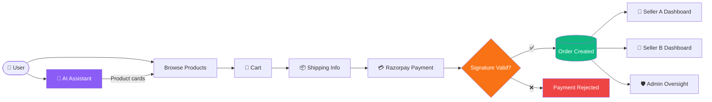

---

## 🛠 Tech Stack

| Layer | Technologies |
|---|---|
| **Frontend** | React, React Router, Redux Toolkit, Axios, Tailwind CSS, Framer Motion, Lucide React, Recharts, React Hot Toast |
| **Core Backend** | Node.js, Express.js, Mongoose, Joi Validation |
| **AI Microservice** | Python, FastAPI, LangChain, Google Gemini, PyMongo |
| **Database** | MongoDB (with compound indexes for query performance) |
| **Caching / Security** | Redis (rate limiting store, JWT blacklist, AI conversation memory) |
| **Auth** | JWT, HttpOnly Cookies, Passport.js, Google OAuth 2.0, bcryptjs |
| **Payments** | Razorpay (Test Mode), HMAC-SHA256 signature verification |
| **Media** | Cloudinary, Multer |
| **Transactional Email** | **Resend API** |
| **Hardening** | Helmet.js, express-rate-limit, rate-limit-redis |

---

## 🏗 System Architecture

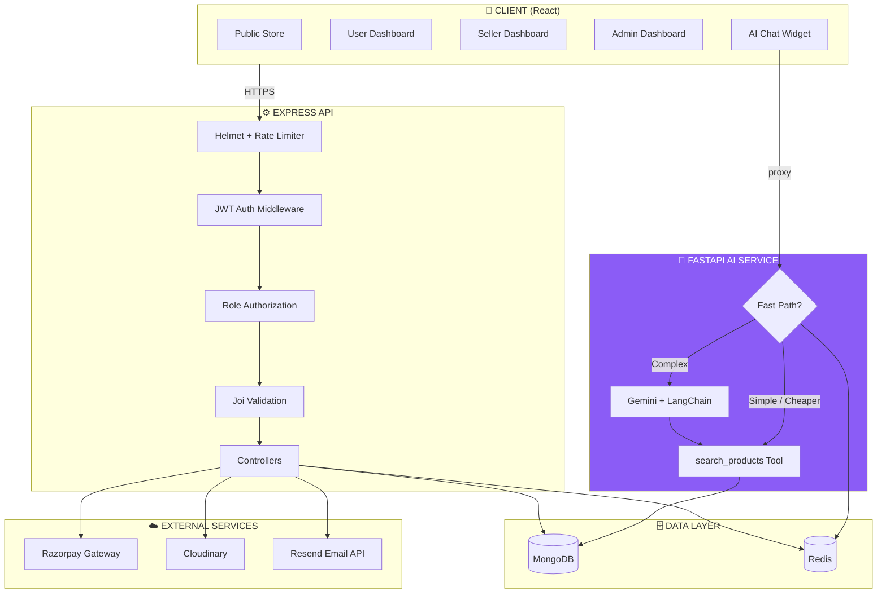

The AI logic lives in its **own Python microservice**, separate from the core Node.js backend — this keeps the store's API lightweight and lets the AI service scale, fail, or redeploy independently of Gemini quota issues.

---

## 👥 Role Capabilities Matrix

| Feature | User | Seller | Admin |
|---|:---:|:---:|:---:|
| Browse / search products (incl. AI chat) | ✅ | ✅ | ✅ |
| Create order | ✅ | ❌ | ❌ |
| View own orders | ✅ | ❌ | ❌ |
| View orders containing their products | ❌ | ✅ (own items only) | ✅ (all) |
| Cancel order (Processing only) | ✅ | ❌ | ✅ |
| Update order status (Processing→Shipped→Delivered) | ❌ | ✅ | — *(view-only by design)* |
| Manage own products (CRUD) | ❌ | ✅ | ❌ *(view-only catalog)* |
| Remove order from personal history | ✅ (Delivered/Cancelled only) | ❌ | ❌ |
| Soft-delete any order | ❌ | ❌ | ✅ |
| View Trash | ❌ | ❌ | ✅ |
| Restore / permanently delete | ❌ | ❌ | ✅ |
| Manage user roles | ❌ | ❌ | ✅ |

> **Design decision:** Admin's product catalog and dashboard are intentionally **view-only** — sellers own their inventory, and admin oversees without direct CRUD interference.

---

## 🔐 Authentication & Security

### Auth Methods

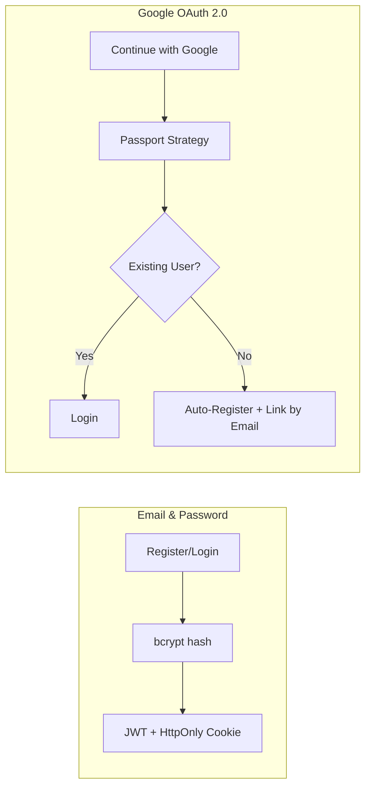

### Forgot / Reset Password

```text
Forgot Password → Generate Reset Token → SHA-256 Hash → Save + 15min Expiry → Resend Email Link
                                                                                    ↓
Login Automatically ← Delete Token ← Hash New Password ← Verify Token + Expiry ←──┘
```

### Role-Based Access Control (RBAC)

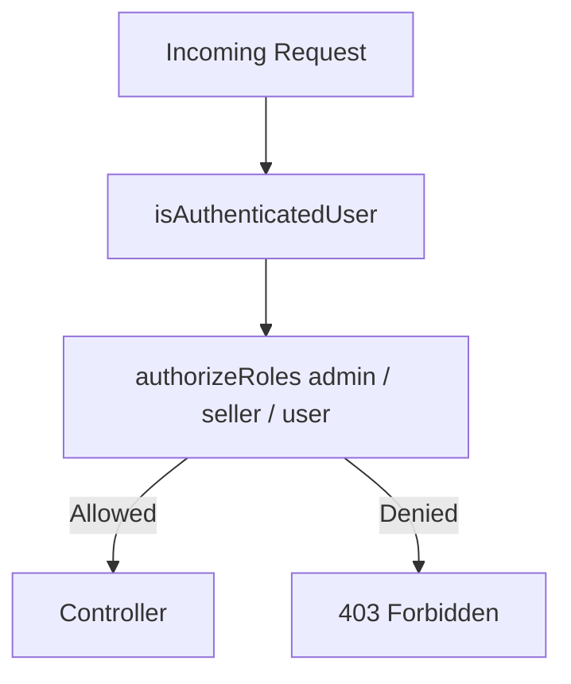

### Security Layer Summary

| # | Layer | Purpose |
|---|---|---|
| 1 | Helmet.js | Secure HTTP headers, clickjacking/MIME-sniffing/XSS mitigation |
| 2 | Redis Rate Limiting | Auth: 10/15min · Password Reset: 5/15min · Global: 300/15min |
| 3 | JWT Blacklisting (Redis) | Logged-out tokens rejected instantly, TTL = remaining JWT life |
| 4 | RBAC | Route-level role enforcement (`user` / `seller` / `admin`) |
| 5 | Ownership Checks | Users/sellers can only touch their own resources |
| 6 | Server-Side Price Verification | Product prices re-fetched from MongoDB, never trusted from client |
| 7 | Atomic Stock Updates | `$inc` + `stock: { $gte: qty }` guard — prevents overselling |
| 8 | MongoDB Transactions | Order + stock deduction commit or rollback together |
| 9 | HMAC-SHA256 Payment Verification | Razorpay signature independently verified server-side |
| 10 | Idempotency | Duplicate Razorpay payment IDs can't create duplicate orders |
| 11 | AI Tool Grounding | AI assistant can only recommend products the search tool actually returned — never invented |

---

## 📦 Product & Review System

- Full **Search → Filter → Sort → Pagination** pipeline via a reusable `APIFunctionality` class
- Filtering supports category, price range (`price[gte]`/`price[lte]`), and minimum rating
- Reviews are **embedded documents** inside each product (one review per user per product)
- Product `ratings` and `numberOfReviews` are **automatically recalculated** on every add/update/delete
- Each review tracks `isVerifiedPurchase` (set once at submission time, based on a matching **Delivered** order for that product) and `helpfulVotes` / `unhelpfulVotes` (one vote per user, toggleable)

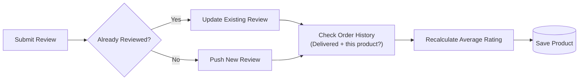

---

## 🔄 Order Lifecycle

Order status only moves **forward** — no skipping steps, no reversals:

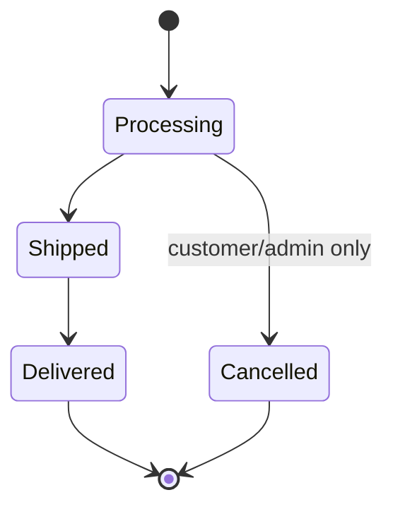

| From | Allowed Next | Notes |
|---|---|---|
| Processing | Shipped, Cancelled | Cancel only allowed here |
| Shipped | Delivered | Cannot cancel once shipped |
| Delivered | — | Final state, fully locked |
| Cancelled | — | Final state, stock restored |

**On creation:** stock validated → DB price used (not frontend price) → items+tax+shipping totalled server-side → stock atomically decremented → transaction committed.

**On cancellation:** only allowed while `Processing`; stock is restored via `$inc`, a cancellation reason is required, and the customer receives a **Resend** email notification.

---

## 🏪 Multi-Vendor Order Routing

A single order can contain products from **multiple sellers**. Each `orderItem` carries its own `seller` reference:

```js
orderItems: [{
  product: ObjectId,
  seller: ObjectId,   // ← enables per-vendor routing
  quantity: Number,
  price: Number,
}]
```

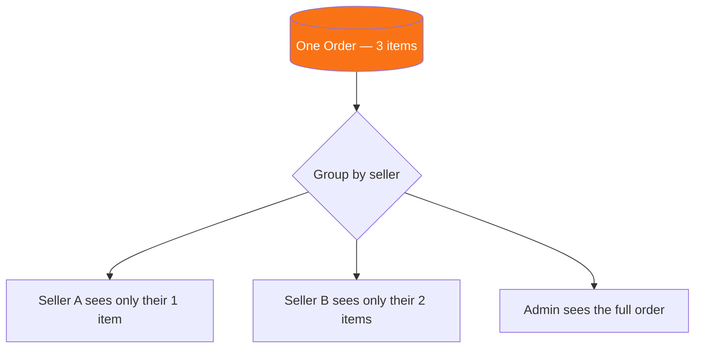

Each seller's order-details view is **scoped**: they only see their own items and their own revenue subtotal — never another seller's items, pricing, or totals from a shared order.

---

## 🗑 Order Trash System

Deletion is **never destructive by default** — orders move through a soft-delete lifecycle before anything is permanently removed.

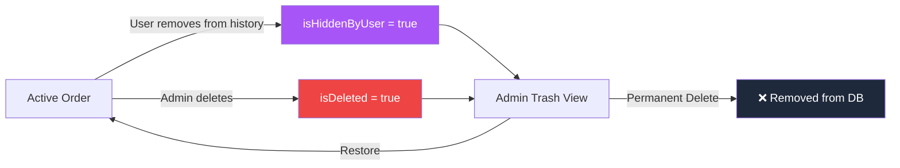

### Two independent flags, one Trash view

| Flag | Set By | Visible To |
|---|---|---|
| `isHiddenByUser` | Customer ("remove from history") | Hidden from that user only — seller & admin still see it |
| `isDeleted` | Admin | Hidden from normal queries — only visible in Admin Trash |

Admin Trash shows **both** (`$or: [{isDeleted}, {isHiddenByUser}]`), and **Empty Trash** permanently deletes everything matching that same combined query — so nothing is silently left behind.

### Guard rails
- A user **cannot** hide a `Processing` or `Shipped` order from their history — only `Delivered` or `Cancelled` (final states). They're told to cancel first, or wait for delivery.
- An order must already be in Trash (`isDeleted` or `isHiddenByUser`) before it can be **permanently** deleted — prevents accidental hard deletes of active orders.

---

## 💳 Razorpay Payment Pipeline

> 🧪 Currently running in **Razorpay Test Mode** — zero real money moves.

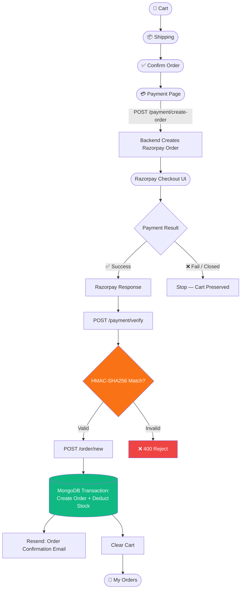

**The golden rule:** the frontend never gets to declare "payment successful." The backend independently regenerates the HMAC-SHA256 signature using `RAZORPAY_KEY_SECRET` (server-only) and compares it — only a match proceeds to order creation.

| Scenario | Order Created? | Cart Cleared? | Retryable? |
|---|:---:|:---:|:---:|
| ✅ Payment succeeds + signature valid | ✅ | ✅ | — |
| ❌ Payment fails | ❌ | ❌ | ✅ |
| 🚪 Modal closed by user | ❌ | ❌ | ✅ |
| 🔁 Signature mismatch | ❌ | ❌ | ✅ |

---

## 📧 Transactional Emails (Resend)

All outgoing transactional email — password reset links, order status updates, order cancellation notices — is sent through the **Resend API** rather than SMTP.

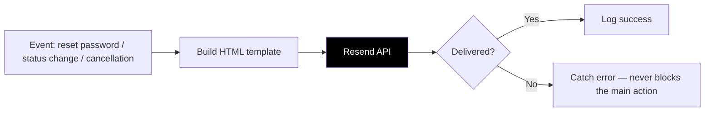

**Design rule carried over from the original Nodemailer version:** email failures must never roll back or block the underlying action (password reset still completes, order status still updates) — the send is wrapped in its own try/catch and only logged on failure.

```js
try {
  await resend.emails.send({
    from: process.env.RESEND_FROM_EMAIL,
    to: user.email,
    subject: "Your Order Has Been Cancelled",
    html: orderCancelledEmailTemplate(user.name, order, reason, comment),
  });
} catch (emailError) {
  // Email failure should NOT roll back the order action
  console.error("Resend email failed:", emailError.message);
}
```

| Email | Trigger |
|---|---|
| Welcome / Verification | Registration |
| Password Reset | Forgot password request |
| Order Status Update | Seller/admin changes order status |
| Order Cancelled | Customer or admin cancels an order |

---

## ⚡ Redis Layer

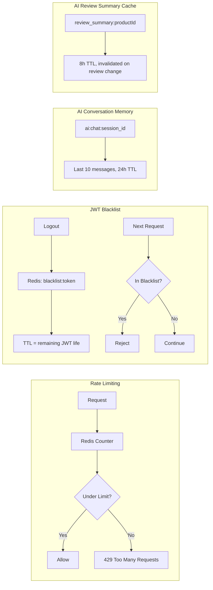

Blacklist entries auto-expire exactly when the original JWT would have — no manual cleanup needed. The AI chat service and the AI review summarizer both reuse the same Redis instance, each under their own key namespace.

---

## 🤖 AI Shopping Assistant

A conversational shopping assistant, built as its **own FastAPI microservice**, that lets users search the catalog in natural language — including Hinglish — and get back real product cards, never invented ones.

```text
User: I need a gaming keyboard
AI:   Mechanical RGB Gaming Keyboard — ₹4499

User: is se cheaper hai?
AI:   (understands "is se" = the keyboard just shown, searches below ₹4499)
```

### Key Features
- **⚡ Fast-path search** — simple queries and "cheaper alternative" follow-ups skip Gemini entirely and go straight to semantic search (`~0.21s` and `~0.34s` observed respectively)
- **🧠 Redis conversation memory** — last 10 messages per `session_id`, 24h TTL
- **📦 Product-aware memory** — the last product discussed is cached separately, enabling instant "cheaper", "similar", same-category follow-ups
- **🔍 Semantic / vector similarity search** — `gaming keyboard` matches `Mechanical RGB Gaming Keyboard` by meaning, filtered further by category/price/stock and a similarity threshold (`limit=5`, `score_threshold=0.70`)
- **🛠 Gemini + LangChain tool calling** — for complex requests, Gemini decides whether to call `search_products(...)`, and is instructed to only recommend products the tool actually returned

### AI Decision Flow

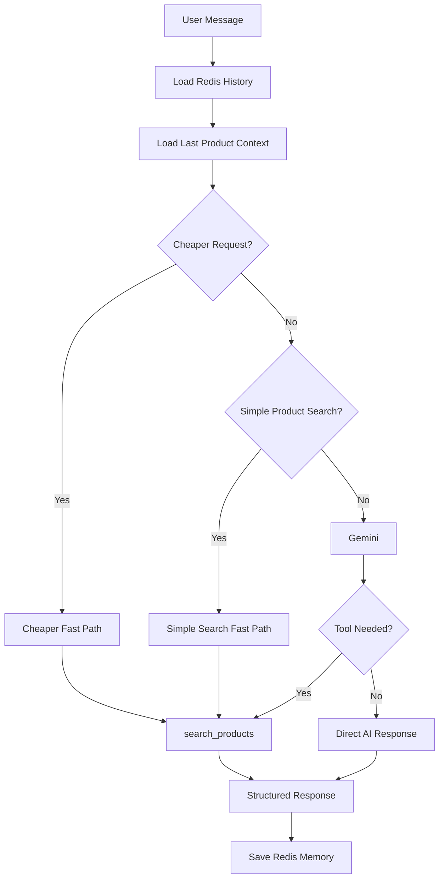

### Complete Request Flow

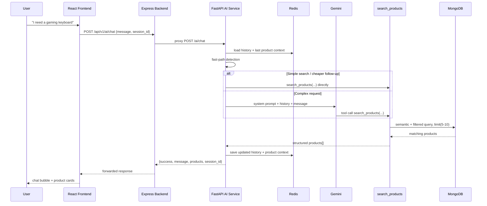

### Product Search Tool

```python
@tool
def search_products(
    keyword: Optional[str] = None,
    category: Optional[str] = None,
    min_price: Optional[float] = None,
    max_price: Optional[float] = None,
    in_stock: bool = True
):
```

Category normalization handles casual phrasing (`shoes` → `Footwear`), and always falls back to a usable search string: `search_query = keyword or category or "products"`.

### AI Response Format

```json
{
  "success": true,
  "message": "Mujhe ye product mila 👇\n\n**Mechanical RGB Gaming Keyboard**\n💰 Price: ₹4499\n📦 Stock: 45",
  "products": [
    {
      "name": "Mechanical RGB Gaming Keyboard",
      "price": 4499,
      "category": "Gaming",
      "stock": 45,
      "id": "6a81a332f43a7f57045c166d",
      "similarity": 0.87
    }
  ],
  "session_id": "speed_test_1"
}
```

### Current Limitations
- Gemini free-tier quota can be exhausted
- Fast-path detection currently covers selected query patterns only
- Product-aware memory tracks only the *most recent* product (no multi-product comparison yet)
- Redis memory expires after 24h TTL

---

## 🧠 AI Review Summarizer

A second, independent AI feature that turns a wall of raw customer reviews into a short, structured summary — overall sentiment, pros, cons, and a one-paragraph take — generated by Gemini and cached in Redis so it's never regenerated on every page load.

```text
3 reviews → not enough signal yet → no summary shown
5+ reviews → AI Summary card appears:

  😊 Mostly Positive
  Pros: Good product quality
  Cons: Poor packaging and bad condition
  "Customers generally consider the product to be good or amazing,
   backed by a positive verified purchase, though one unverified
   review noted poor packaging and bad condition."
```

### Why a separate AI call, not part of the chat assistant

The shopping assistant (`ask_ai()`) is a large, stateful, tool-calling workflow already handling chat history and product-context memory. Review summarization is a different, stateless AI task — one product's reviews in, one structured JSON out — so it lives in its **own service file** (`review_summary_service.py`) inside the same FastAPI microservice, with its own Gemini call. Neither workflow touches the other.

### Key Features
- **🎯 Verified-purchase weighting** — reviews are tagged `isVerifiedPurchase` before being sent to Gemini, with an explicit prompt rule: verified reviews are stronger evidence, but non-verified reviews are never fully ignored
- **📦 Structured, strict-JSON output** — Gemini is instructed to return only `{overall_sentiment, pros[], cons[], summary}`, no markdown, no prose outside the JSON
- **🛡️ Resilient parsing** — handles markdown-fenced responses, Python-dict-style quoting, and the newer Gemini SDK's list-of-content-block format, with a safe fallback if parsing still fails
- **⚡ Redis-cached in Node, not Python** — the AI microservice stays a pure "reviews in → summary out" function; caching, TTL, and invalidation all live in the Node backend, next to the review data it's summarizing
- **🔄 Auto-invalidated on change** — creating, updating, or deleting a review deletes the cached summary for that product, so a stale AI opinion never lingers
- **🚫 Minimum-review gate** — summaries aren't generated (or requested) until a product has at least 3 reviews, avoiding a "summary" of a single opinion

### Architecture Flow

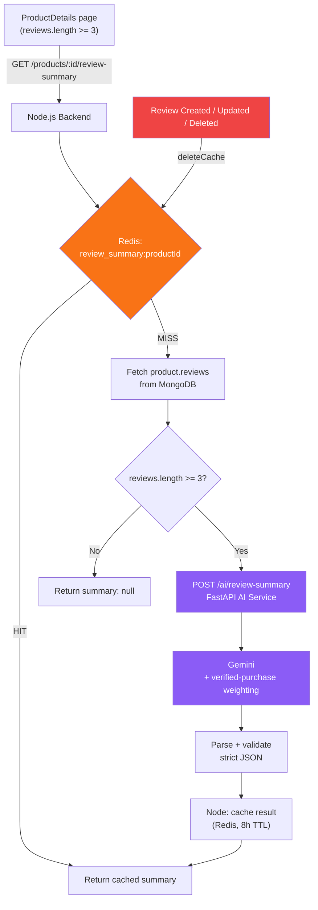

### Complete Request Flow

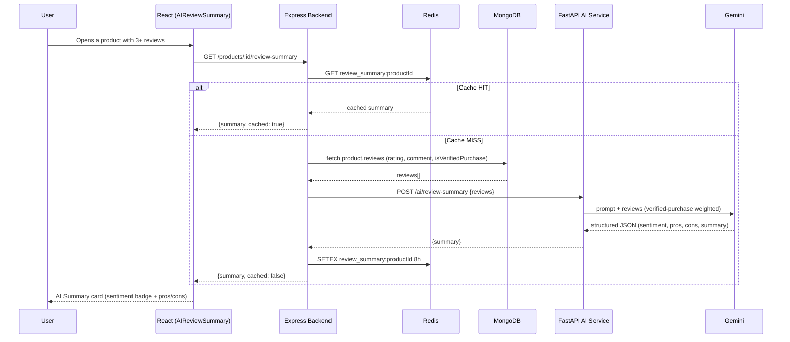

### Example Response

```json
{
  "success": true,
  "summary": {
    "overall_sentiment": "positive",
    "pros": ["Good product quality"],
    "cons": ["Poor packaging and bad condition"],
    "summary": "Customers generally consider the product to be good or amazing, backed by a positive verified purchase, though one unverified review noted poor packaging and bad condition."
  },
  "cached": false
}
```

### Cache Invalidation Rule

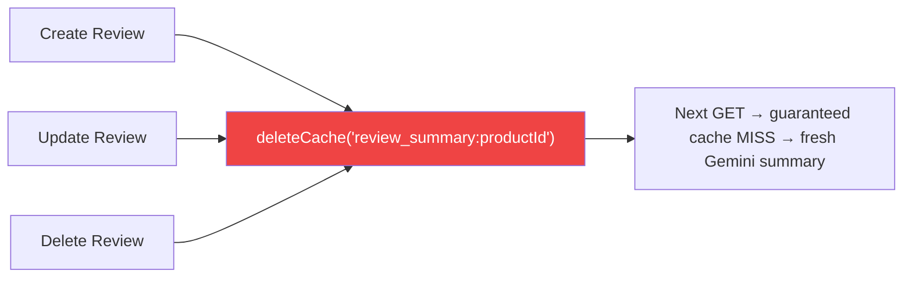

### Current Limitations
- Summary only regenerates on the *next* request after a review change — not proactively pre-warmed
- No per-language summary selection yet (always summarized in English regardless of review language)
- Only the latest 100 reviews per product are sent to Gemini, to keep prompt size bounded on high-review products

---

## 📡 Complete API Reference

### Auth
| Method | Endpoint | Access |
|---|---|---|
| POST | `/api/v1/auth/register` | Public (rate-limited) |
| POST | `/api/v1/auth/login` | Public (rate-limited) |
| GET | `/api/v1/auth/google` | Public |
| GET | `/api/v1/auth/google/callback` | Public |
| POST | `/api/v1/auth/password/forgot` | Public (rate-limited) — sends via Resend |
| PUT | `/api/v1/auth/password/reset/:token` | Public |
| GET | `/api/v1/auth/me` | Private |
| PUT | `/api/v1/auth/me/update` | Private |

### Products & Reviews
| Method | Endpoint | Access |
|---|---|---|
| GET | `/api/v1/products` | Public — search/filter/sort/pagination |
| GET | `/api/v1/product/:id` | Public |
| PUT | `/api/v1/review` | Private — add/update review |
| GET | `/api/v1/products/reviews?id=` | Public |
| DELETE | `/api/v1/review` | Private |
| PUT | `/api/v1/products/:id/review/vote` | Private — helpful/unhelpful toggle |
| GET | `/api/v1/products/:id/review-summary` | Public — AI-generated review summary (Redis-cached) |

### Orders
| Method | Endpoint | Access |
|---|---|---|
| POST | `/api/v1/order/new` | User |
| GET | `/api/v1/orders/me` | User |
| GET | `/api/v1/order/:id` | User (own) / Admin |
| PUT | `/api/v1/order/cancel/:id` | User (own, Processing only) / Admin |
| DELETE | `/api/v1/order/my/:id` | User — hide from history (Delivered/Cancelled only) |

### Seller
| Method | Endpoint | Access |
|---|---|---|
| GET | `/api/v1/seller/orders` | Seller — own items only |
| GET | `/api/v1/seller/orders/:id` | Seller — scoped to own items |
| PUT | `/api/v1/seller/orders/:id` | Seller — forward-only status update |
| CRUD | `/api/v1/seller/products/*` | Seller — own catalog |
| GET | `/api/v1/seller/products/:id` | Seller — full product details + review moderation view |
| DELETE | `/api/v1/seller/products/:id/reviews/:userId` | Seller — delete any review on their own product |

### Admin
| Method | Endpoint | Access |
|---|---|---|
| GET | `/api/v1/admin/dashboard` | Admin — read-only stats |
| GET | `/api/v1/admin/orders` | Admin |
| DELETE | `/api/v1/admin/order/:id` | Admin — soft delete |
| GET | `/api/v1/admin/orders/deleted` | Admin — Trash view |
| PUT | `/api/v1/admin/order/restore/:id` | Admin |
| DELETE | `/api/v1/admin/order/permanent/:id` | Admin |
| DELETE | `/api/v1/admin/orders/trash/empty` | Admin |
| GET | `/api/v1/admin/products` | Admin — view-only catalog |
| GET | `/api/v1/admin/users` | Admin |
| PUT | `/api/v1/auth/admin/user/:id` | Admin — role update (self-demotion blocked) |
| DELETE | `/api/v1/auth/admin/user/:id` | Admin — delete user (self-deletion blocked) |

### Payments
| Method | Endpoint | Access |
|---|---|---|
| POST | `/api/v1/payment/create-order` | Private |
| POST | `/api/v1/payment/verify` | Private |

### AI Assistant
| Method | Endpoint | Access |
|---|---|---|
| POST | `/api/v1/ai/chat` | Public/Private — proxied to the FastAPI AI service |
| GET | `/semantic-search?query=` | AI service — standalone test endpoint |

### AI Review Summarizer
| Method | Endpoint | Access |
|---|---|---|
| GET | `/api/v1/products/:id/review-summary` | Public — Redis cache check → FastAPI on miss |
| POST | `/ai/review-summary` | AI service — internal, called only by the Node backend |

---

## 📁 Folder Structure

```
backend/
├── config/
│   ├── cloudinary.js
│   ├── db.js
│   ├── redis.js
│   └── passport.js
├── controllers/
│   ├── authController/
│   ├── orderController/
│   │   ├── createOrderController.js
│   │   ├── cancelOrderController.js
│   │   ├── orderTrashController.js      # delete / restore / trash / empty
│   │   ├── getAllOrdersController.js
│   │   ├── getMyOrdersController.js
│   │   ├── getSingleOrderController.js
│   │   └── updateOrderStatusController.js
│   ├── sellerController/
│   │   └── sellerOrderDetailsController.js
│   ├── productController/
│   │   ├── createReviewController.js
│   │   ├── getReviewsController.js
│   │   ├── deleteReviewController.js
│   │   ├── voteReviewController.js
│   │   └── getReviewSummaryController.js   # AI review summary: cache + FastAPI call
│   ├── reviewController/
│   │   └── deleteReviewController.js       # seller-side: delete any review on own product
│   ├── aiController.js                  # proxies to FastAPI AI service
│   └── paymentController/
│       ├── createRazorpayOrderController.js
│       └── verifyPaymentController.js
├── middlewares/
│   ├── auth.js              # isAuthenticatedUser, authorizeRoles
│   ├── asyncHandler.js
│   ├── validate.js
│   ├── rateLimiter.js
│   └── error.js
├── models/
│   ├── orderModel.js
│   ├── productModel.js
│   └── userModel.js
├── routes/
├── validators/
├── utils/
│   ├── errorHandler.js
│   ├── sendEmail.js          # Resend API wrapper
│   ├── redisCache.js         # getCache / setCache / deleteCache
│   └── emailTemplates.js
├── app.js
└── server.js

ai-service/                    # Python / FastAPI
├── main.py
├── config/
│   ├── db.py                  # MongoDB connection
│   └── redis.py                # Redis connection + memory storage
├── services/
│   ├── ai_service.py          # Orchestration: memory, fast paths, Gemini, tool calls
│   ├── review_summary_service.py  # AI Review Summarizer: prompt, Gemini call, JSON parsing
│   ├── embedding_service.py   # Text → vector embeddings
│   └── semantic_search.py     # Similarity matching + filtering
├── tools/
│   └── product_tools.py       # search_products tool + category normalization
└── requirements.txt

frontend/src/
├── pages/
│   ├── Products.jsx / ProductDetails.jsx / Cart.jsx
│   ├── admin/ (AdminDashboard, AdminProducts, AdminProductDetails, AdminSidebar, AdminDeletedOrders)
│   └── seller/ (SellerOrderDetails, SellerProducts, SellerProductDetails)
├── components/
│   ├── layout/ (Header, Footer)
│   ├── review/ (RatingSummary, ReviewList, ReviewCard, ReviewForm, AIReviewSummary)
│   ├── seller/ (SellerReviewCard)
│   └── AIFeatures/AIShoppingAssistant.jsx
├── redux/slices/
└── api/axios.js
```

---

## ⚙️ Environment Variables

```env
PORT=8000
NODE_ENV=development

MONGO_URI=your_mongodb_connection_string

JWT_SECRET=your_super_secret_key
JWT_EXPIRE=7d
COOKIE_EXPIRE=7

REDIS_URL=your_redis_connection_string

GOOGLE_CLIENT_ID=your_google_client_id
GOOGLE_CLIENT_SECRET=your_google_client_secret
GOOGLE_CALLBACK_URL=http://localhost:8000/api/v1/auth/google/callback

# Transactional email — Resend
RESEND_API_KEY=your_resend_api_key
RESEND_FROM_EMAIL=Shopzy <onboarding@yourdomain.com>

RAZORPAY_KEY_ID=rzp_test_xxxxxxxxx
RAZORPAY_KEY_SECRET=xxxxxxxxxxxxxxxx

CLOUDINARY_CLOUD_NAME=your_cloud_name
CLOUDINARY_API_KEY=your_api_key
CLOUDINARY_API_SECRET=your_api_secret

# FastAPI AI microservice base URL — used to proxy chat + review-summary requests
AI_SERVICE_URL=http://localhost:8000

# AI microservice (ai-service/.env)
GEMINI_API_KEY=your_gemini_api_key
MONGODB_URI=your_mongodb_connection_string
REDIS_URL=your_redis_connection_url
```

> ⚠️ `RAZORPAY_KEY_SECRET`, `JWT_SECRET`, `RESEND_API_KEY`, and `GEMINI_API_KEY` must **never** reach the frontend. Always `.gitignore` your `.env` files.

---

## ✅ Testing Checklist

<details>
<summary><b>Auth & Security</b></summary>

- [ ] Register, login, logout all work; logged-out JWT is rejected on next request (blacklist)
- [ ] Google OAuth login creates/links account correctly
- [ ] Forgot → reset password flow completes, Resend delivers the email, and login succeeds after reset
- [ ] Exceeding rate limits returns `429`
- [ ] Non-admin hitting an admin route gets `403`

</details>

<details>
<summary><b>Products & Reviews</b></summary>

- [ ] Search, filter (category/price/rating), sort, and pagination all combine correctly
- [ ] Submitting a second review from the same user updates it instead of duplicating
- [ ] Product `ratings`/`numberOfReviews` update correctly after add/update/delete
- [ ] A review submitted after a Delivered order for that product is marked `isVerifiedPurchase: true`
- [ ] Helpful/unhelpful vote toggles correctly (one vote per user, switching removes the previous vote)

</details>

<details>
<summary><b>Orders & Payments</b></summary>

- [ ] Successful payment → signature verified → order created → stock reduced → cart cleared
- [ ] Failed/cancelled payment → no order, cart preserved
- [ ] Duplicate payment callback → only one order created
- [ ] Order status only moves forward (Processing→Shipped→Delivered); skipping/reversing is rejected
- [ ] Cancel works only while Processing; stock is restored; Shipped/Delivered cancel attempts are rejected
- [ ] Order status change and cancellation both trigger a Resend email, and email failure never blocks the action

</details>

<details>
<summary><b>Multi-Vendor & Trash</b></summary>

- [ ] A multi-seller order shows each seller **only their own items and revenue**
- [ ] User hiding a Processing/Shipped order from history is blocked with a clear message
- [ ] Admin Trash shows both admin-deleted and user-hidden orders
- [ ] Empty Trash removes **all** trash items (both flag types), not just admin-deleted ones
- [ ] Restore brings an order back to fully active state for everyone

</details>

<details>
<summary><b>AI Shopping Assistant</b></summary>

- [ ] Simple search (`"I need a gaming keyboard"`) hits the fast path — no Gemini call, product returned
- [ ] Cheaper follow-up (`"is se cheaper hai?"`) in the same session correctly reads last product price from Redis
- [ ] Complex query (`"best t-shirt"`) routes through Gemini → tool call → semantic search → conversational response
- [ ] Hinglish query (`"mujhe women ke clothes dikhao"`) returns relevant results
- [ ] No-match query returns `"products": []` with a graceful message, never an invented product

</details>

<details>
<summary><b>AI Review Summarizer</b></summary>

- [ ] Product with fewer than 3 reviews shows no summary card (`summary: null`), and no Gemini call is made
- [ ] Product with 3+ reviews returns a structured summary on first load (`cached: false`)
- [ ] Repeating the same request immediately returns `cached: true` with no Python/Gemini call
- [ ] Adding, editing, or deleting a review on that product invalidates the cache — next request is `cached: false` again with updated pros/cons
- [ ] Gemini responses wrapped in markdown fences, single-quoted Python-dict style, or the newer list-of-content-block SDK format are all parsed correctly
- [ ] A malformed/unparseable Gemini response falls back to a safe default instead of crashing the request

</details>

> A more detailed, click-through version of the platform checklist (with exact test data setup) is maintained separately in `testing-checklist.md`.

---

## 🚀 Roadmap

**Platform**
- [ ] Redis-based distributed rate limiting refinements (sliding window)
- [ ] Webhook handling for async Razorpay events
- [ ] Refund flow + payment reconciliation
- [ ] Two-Factor Authentication (2FA)
- [x] Review pagination, sorting, and "verified purchase" badges
- [ ] Seller "request cancellation" flow (admin-approved) instead of direct cancel access
- [ ] Production hardening pass before going live with real Razorpay keys

**AI Assistant**
- [ ] Add to Cart / Wishlist / Buy Now directly from chat
- [ ] Product comparison and multi-product context tracking
- [ ] Additional tools: `get_product_details`, `track_order`, `add_to_cart`, `recommend_products`
- [ ] Streaming responses, fallback AI models, local intent classification
- [ ] Persistent long-term user preference memory
- [ ] Structured logging, monitoring, and Docker/CI-CD deployment for the AI microservice
- [x] AI-generated review summaries (sentiment, pros/cons) with Redis caching

---

<div align="center">

### 🎯 Built as a complete, interview-ready demonstration of production e-commerce concepts:
**Authentication · RBAC · Multi-Vendor Architecture · Atomic Inventory · MongoDB Transactions · Verified Payments · Soft-Delete Systems · Redis Security · Conversational AI Search · AI Review Summarization**

**Author:** Hardeep Singh

</div>