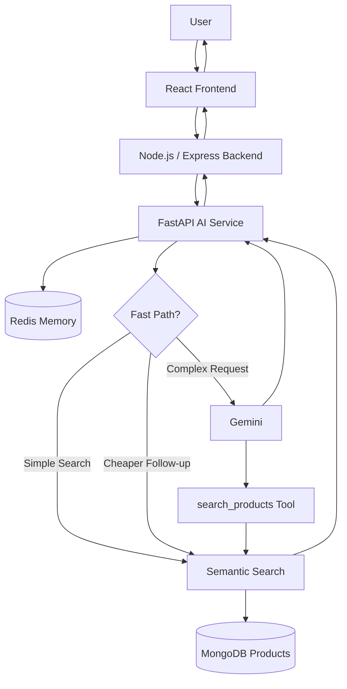
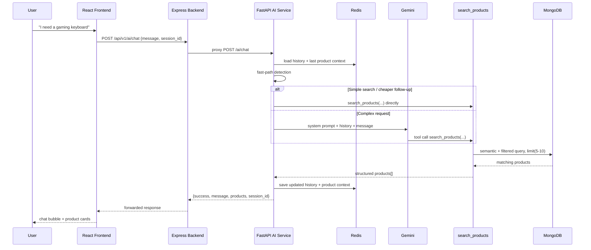
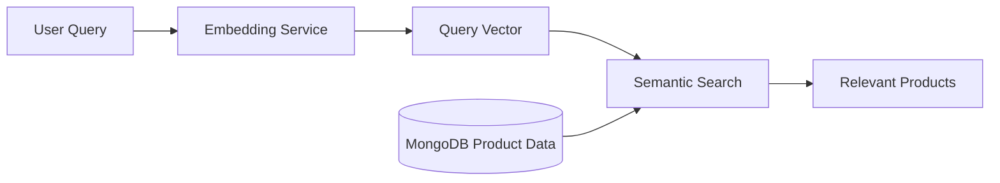
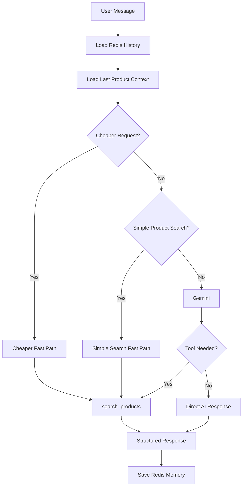

# 🛒 NexusCart AI — Intelligent Shopping Assistant

**Natural Language → Intent Detection → Fast Product Search / AI Tool Calling → Semantic Search → Real Product Data → Conversational Response**

NexusCart AI is an AI-powered conversational shopping assistant built for the **NexusCart** MERN e-commerce platform. Users can search products using natural language and Hinglish, ask follow-up questions, request cheaper alternatives, and get real products back from the database as structured product cards — not invented text.

The system combines:

- ⚡ **Fast-path product search** for simple, predictable queries (no LLM call needed)
- 🤖 **Gemini + LangChain tool calling** for complex shopping requests
- 🧠 **Redis conversation memory** for multi-turn context
- 📦 **Product-aware memory** for follow-ups like "cheaper option"
- 🔍 **Semantic / vector similarity search** (meaning-based, not just keywords)
- 💰 **Price, category, and stock filtering**
- 🎨 **Structured API responses** that render as frontend product cards

---

## 📑 Table of Contents

1. [Overview](#-overview)
2. [Key Features](#-key-features)
3. [Tech Stack](#-tech-stack)
4. [High-Level Architecture](#-high-level-architecture)
5. [Complete Request Flow](#-complete-request-flow)
6. [Performance Optimization & Fast Paths](#-performance-optimization--fast-paths)
7. [Product Search Tool](#-product-search-tool)
8. [Semantic Search](#-semantic-search)
9. [Conversation & Product Memory](#-conversation--product-memory)
10. [AI Decision Flow](#-ai-decision-flow)
11. [API Response Format](#-api-response-format)
12. [Frontend Integration](#-frontend-integration)
13. [Project Structure](#-project-structure)
14. [Environment Variables](#-environment-variables)
15. [Installation & Running](#-installation--running)
16. [Testing](#-testing)
17. [Error Handling](#-error-handling)
18. [Design Principle](#-design-principle)
19. [Performance Results](#-performance-results)
20. [Current Limitations](#-current-limitations)
21. [Roadmap / Future Improvements](#-roadmap--future-improvements)

---

## 🚀 Overview

Traditional e-commerce search depends on exact keyword matching. NexusCart AI makes product discovery conversational instead.

```text
User: I need a gaming keyboard
AI:   Mechanical RGB Gaming Keyboard — ₹4499

User: is se cheaper hai?
AI:   (understands "is se" = the keyboard just shown, searches below ₹4499)
```

For a query like `best t-shirt`, the system uses the AI model to understand intent, call the product search tool, retrieve real products, and generate a conversational response — rather than answering from general knowledge.

---

## ✨ Key Features

**🔍 Natural Language Product Search**
`I need a gaming keyboard` · `best t-shirt` · `show me running shoes` · `mujhe women ke clothes dikhao`

**⚡ Fast Product Search (no LLM needed)**
Simple product-search queries are detected directly and routed straight to semantic search — skipping Gemini entirely. This cuts latency, token usage, and API quota consumption significantly.

**💰 Cheaper Alternative Detection**
Follow-up phrases like `is se cheaper hai?`, `isse sasta dikhao`, `cheaper option`, `kuch sasta hai?` are detected as a **fast path**. The system pulls the last discussed product from Redis and searches with `max_price = previous_price - 1` — again, no Gemini call required.

**🧠 Redis Conversation Memory**
Each session (`session_id`) stores recent user/AI messages with a 24-hour TTL, enabling context-aware follow-ups.

**📦 Product-Aware Memory**
Beyond plain chat history, the last *product* discussed is cached separately — enabling fast "cheaper", "similar", or same-category follow-ups without re-parsing the whole conversation.

**🔍 Semantic Product Search**
`gaming keyboard` can match `Mechanical RGB Gaming Keyboard` via vector similarity, not just exact text — filtered further by category, price range, stock, and a similarity threshold.

**🛠 AI Tool Calling**
For complex requests, Gemini (via LangChain) decides whether to call `search_products(...)`. The AI is instructed to recommend only products actually returned by the tool — never to invent product information.

---

## 🛠 Tech Stack

| Layer | Technology |
|---|---|
| Frontend | React + Vite |
| Core Backend | Node.js + Express.js |
| Database | MongoDB (Atlas) |
| AI Service | Python + FastAPI |
| AI Framework | LangChain |
| AI Model | Google Gemini |
| Conversation Memory | Redis |
| Product Search | Semantic / vector similarity search |
| AI Database Driver | PyMongo |
| Product Tool | LangChain `@tool` |
| API Communication | REST / JSON |
| DevOps (planned) | Docker, CI/CD |

---

## 🏗 High-Level Architecture



The AI logic lives in its **own Python microservice**, kept separate from the core Node.js backend — this keeps the store's API lightweight and lets the AI service scale, fail, or redeploy independently of Gemini quota issues.

---

## 🔄 Complete Request Flow



**Steps in detail:**

1. User sends `{message, session_id}` to `POST /ai/chat`
2. FastAPI loads Redis conversation history and the last product context
3. **Fast-path detection** runs before any Gemini call:
   - Simple product search → straight to `search_products` → semantic search → MongoDB
   - Cheaper follow-up → reads last product's price from Redis → `max_price = previous_price - 1` → search directly
4. If neither fast path applies, Gemini receives the system prompt + history + message and decides whether to call the tool
5. `search_products` runs a semantic + filtered MongoDB query, capped with `.limit(...)`
6. Gemini formats a conversational response (for complex paths); fast paths can respond directly without waiting on Gemini
7. Redis is updated with the new message, response, and latest product context

---

## ⚡ Performance Optimization & Fast Paths

A full Gemini-driven request needs: **tool decision → product search → final response generation** — three round trips that add latency, cost, and quota usage. For predictable query patterns, this is unnecessary.

**Simple Product Search Fast Path**

```text
"I need a gaming keyboard"
Intent Detection → Product Search → Direct Structured Response
Observed: ~0.21 seconds
```

**Cheaper Product Fast Path**

```text
"is se cheaper hai?"
Read last product from Redis → previous price → max_price = price - 1 → Search → Return
Observed: ~0.34 seconds
```

**Why fast paths matter:** faster responses, lower API cost, lower token usage, less quota exhaustion, better scalability, and more deterministic behavior for known query patterns.

---

## 🛒 Product Search Tool

Implemented with LangChain's `@tool` decorator:

```python
@tool
def search_products(
    keyword: Optional[str] = None,
    category: Optional[str] = None,
    min_price: Optional[float] = None,
    max_price: Optional[float] = None,
    in_stock: bool = True
):
```

| Parameter | Purpose |
|---|---|
| `keyword` | Product name or search query |
| `category` | Product category |
| `min_price` | Minimum allowed price |
| `max_price` | Maximum allowed price |
| `in_stock` | Return only available products |

**Category normalization** — users say `shoes`, the database stores `Footwear`:

```python
CATEGORY_MAP = {
    "electronics": "Electronics", "gaming": "Gaming", "fashion": "Fashion",
    "footwear": "Footwear", "shoes": "Footwear", "beauty": "Beauty",
    "home": "Home", "accessories": "Accessories"
}
```

**Search query fallback** — the tool always gets a meaningful query to work with:

```python
search_query = keyword or category or "products"
```

---

## 🧬 Semantic Search



Results are filtered by category, price range, stock, and a **similarity threshold**. Current tool configuration: `limit=5`, `score_threshold=0.70`.

A standalone test endpoint is also exposed:

```text
GET /semantic-search?query=gaming keyboard
```

```json
{
  "success": true,
  "query": "clothes for women",
  "results": []
}
```

Results depend on what's actually in the product database and the current similarity threshold.

---

## 🧠 Conversation & Product Memory

Redis key per session: `ai:chat:{session_id}` (e.g. `ai:chat:speed_test_1`)

```json
[
  {"role": "user", "content": "I need a gaming keyboard"},
  {"role": "assistant", "content": "Mujhe ye product mila..."}
]
```

- History capped at **last 10 messages** (≈ 5 turns)
- TTL: `86400` seconds (24 hours)

**Product context** is stored separately for fast follow-ups:

```json
{"name": "Mechanical RGB Gaming Keyboard", "price": 4499, "category": "Gaming", "stock": 45}
```

This enables cheaper-alternative lookups, similar-product logic, same-category searches, and (future) product comparison — without re-parsing full chat history.

---

## 🤖 AI Decision Flow



---

## 📡 API Response Format

**Successful product search**

```json
{
  "success": true,
  "message": "Mujhe ye product mila 👇\n\n**Mechanical RGB Gaming Keyboard**\n💰 Price: ₹4499\n📦 Stock: 45",
  "products": [
    {
      "name": "Mechanical RGB Gaming Keyboard",
      "description": "High-performance mechanical gaming keyboard with RGB lighting and responsive switches.",
      "price": 4499,
      "category": "Gaming",
      "stock": 45,
      "ratings": 0,
      "id": "6a81a332f43a7f57045c166d",
      "similarity": 0.8746993541717529
    }
  ],
  "session_id": "speed_test_1"
}
```

**No matching product**

```json
{
  "success": true,
  "message": "Sorry, ₹4499 se cheaper matching product abhi available nahi mila.",
  "products": [],
  "session_id": "speed_test_1"
}
```

---

## 🎨 Frontend Integration

The frontend receives `message` + `products[]` and renders both independently:

```text
AI Response
   ├── message → Chat Bubble
   └── products[] → Product Cards
                       ├── name, price, description, category, stock, ratings
                       └── "View Details →" → /products/:id
```

---

## 🗂 Project Structure

```text
NexusCart-AI/
│
├── frontend/
│   └── src/
│       ├── components/
│       │   └── AIFeatures/
│       │       └── AIShoppingAssistant.jsx
│       └── App.jsx
│
├── backend/                       # Node.js / Express
│   ├── controllers/
│   │   └── aiController.js
│   ├── routes/
│   │   └── aiRoutes.js
│   └── server.js
│
└── ai-service/                    # Python / FastAPI
    ├── main.py
    ├── config/
    │   ├── db.py                  # MongoDB connection
    │   └── redis.py               # Redis connection + memory storage
    ├── services/
    │   ├── ai_service.py          # Orchestration: memory, fast paths, Gemini, tool calls
    │   ├── embedding_service.py   # Text → vector embeddings
    │   └── semantic_search.py     # Similarity matching + filtering
    ├── tools/
    │   └── product_tools.py       # search_products tool + category normalization
    └── requirements.txt
```

**Key file responsibilities:**

| File | Responsible For |
|---|---|
| `main.py` | FastAPI setup, `/ai/chat` endpoint, request validation, response formatting |
| `services/ai_service.py` | Redis memory + product context loading, fast-path detection, Gemini calls, tool handling, saving memory |
| `tools/product_tools.py` | Product search tool, category normalization, price/stock filtering, calling semantic search |
| `services/semantic_search.py` | Semantic retrieval, similarity matching, filtering |
| `services/embedding_service.py` | Generating embeddings for products/queries |
| `config/redis.py` | Redis connection, conversation storage, product context storage |

---

## 🔐 Environment Variables

```env
GEMINI_API_KEY=your_gemini_api_key
MONGODB_URI=your_mongodb_connection_string
REDIS_URL=your_redis_connection_url
```

Never commit secrets. Recommended `.gitignore`:

```text
.env
config.env
venv/
__pycache__/
node_modules/
dist/
*.pyc
```

---

## ⚙️ Installation & Running

**1. Clone the project**
```bash
git clone <your-repository-url>
cd NexusCart-AI
```

**2. Set up the AI service**
```bash
cd ai-service
python -m venv venv
.\venv\Scripts\Activate.ps1        # Windows PowerShell
pip install -r requirements.txt
uvicorn main:app --reload --port 9000
```
Runs at: `http://127.0.0.1:9000`

**3. Run the frontend**
```bash
cd frontend
npm install
npm run dev
```
Runs at (typically): `http://localhost:5173`

---

## 🧪 Testing

| # | Test | Request | Expected |
|---|---|---|---|
| 1 | Basic search | `{"message": "I need a gaming keyboard", "session_id": "speed_test_1"}` | Simple search detected → tool runs → product returned → context saved |
| 2 | Cheaper follow-up | `{"message": "is se cheaper hai?", "session_id": "speed_test_1"}` (same session) | Last product loaded from Redis, searched below previous price, **no Gemini call** |
| 3 | Complex query | `{"message": "best t-shirt", "session_id": "speed_test_2"}` | Gemini → tool call → semantic search → final conversational response |
| 4 | Hinglish search | `{"message": "mujhe women ke clothes dikhao", "session_id": "hinglish_test_1"}` | Intent understood → relevant fashion products returned |
| 5 | No results | `{"message": "₹500 ke andar gaming laptop dikhao", "session_id": "no_result_test"}` | `"products": []` with a graceful "not found" message |

---

## 🛡 Error Handling

| Scenario | Expected Handling |
|---|---|
| Gemini quota exhausted (`429 RESOURCE_EXHAUSTED`) | Safe AI error / fallback response |
| Gemini request cancelled | Handled without crashing the service |
| Product search returns empty | `"products": []` with a useful message |
| Redis unavailable | Continue where possible without memory |
| MongoDB unavailable | Controlled service error |
| Empty message | Request validation (`400 Message is required`) |
| Slow AI request | Request timeout (Express proxy: `40000ms`) |
| Tool result empty | AI must not invent products |

**Recommended future improvements:** retry logic, exponential backoff, fallback model, request queueing, rate limiting, better local intent detection.

---

## 🎯 Design Principle

> **The AI should not invent products. Product recommendations must come from the real product search tool / database.**

| Responsibility | Owner |
|---|---|
| Understanding user intent & context | LLM (Gemini) |
| Deciding when a tool is required | LLM (Gemini) |
| Formatting the conversational response | LLM (Gemini) |
| Product truth — prices, stock, IDs, categories, metadata | Database (MongoDB) |

---

## 📈 Performance Results

| Request Type | Example | Approx. Time |
|---|---|---|
| Simple Search Fast Path | "I need a gaming keyboard" | ~0.21 sec |
| Cheaper Follow-up Fast Path | "is se cheaper hai?" | ~0.34 sec |
| Gemini Tool Decision + Final Response | "best t-shirt" | Several seconds |
| Older multi-step AI flow (no fast path) | Tool decision + final response | Notably slower |

Actual production latency also depends on Gemini API response time, database performance, network conditions, embedding generation, and Redis availability.

---

## ⚠️ Current Limitations

- Gemini API quota can be exhausted (free tier)
- Complex AI requests depend on external API latency
- Fast-path detection currently covers selected query patterns only
- Product catalog size is limited during development
- Semantic search quality depends on embeddings and product data quality
- Product-aware memory currently tracks only the most recent product
- Redis memory expires after the configured TTL (24h)
- Complex multi-product comparisons may need improved intent parsing

---

## 🚀 Roadmap / Future Improvements

**🛒 Shopping features**
Add to Cart from AI chat · Wishlist integration · Buy Now actions · Product comparison · Discounts/offers · Product image cards

**🤖 AI features**
Streaming responses · Fallback AI models · Local intent classification · Multi-product comparison · Personalized recommendations · Product explanation tool · Recommendation ranking

**📦 Planned tools**
```text
search_products · get_product_details · compare_products
track_order · add_to_cart · get_cart · get_order_status · recommend_products
```
Example: `"Bhai mera order kaha tak pahucha?"` → `track_order(order_id)`

**🧠 Memory improvements**
Persistent long-term memory · user preference memory · recently viewed products · multi-product context tracking · conversation summarization · better session management

**📈 Production improvements**
Structured logging · monitoring · health checks · API authentication · rate limiting · retry logic · circuit breakers · Redis monitoring · background tasks · caching frequent searches · Docker deployment · CI/CD pipeline

---

## 👨‍💻 Author

**Hardeep Singh**
Developer of NexusCart AI

> 🛒 NexusCart AI = Natural Language + Fast Intent Handling + AI Tool Calling + Redis Memory + Semantic Search + Real Product Data