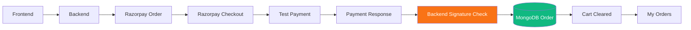
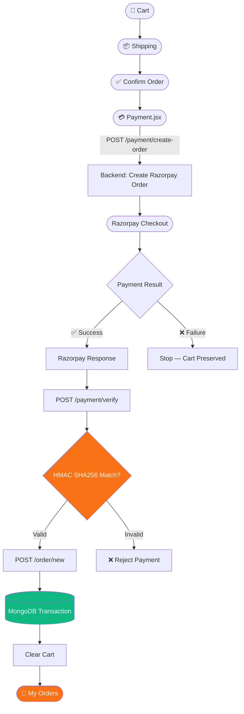
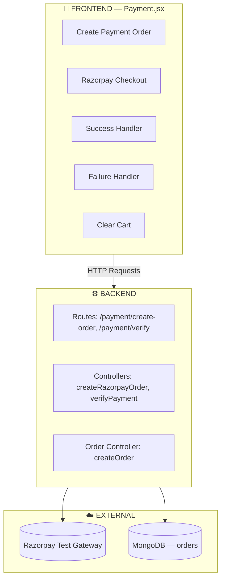
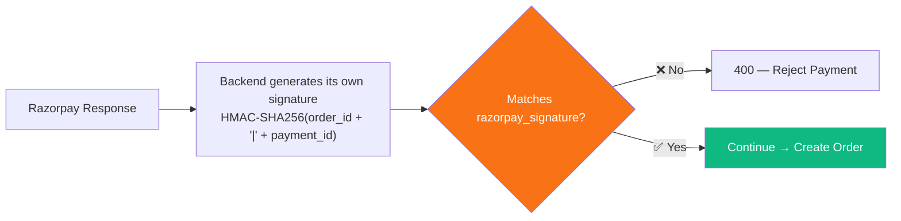
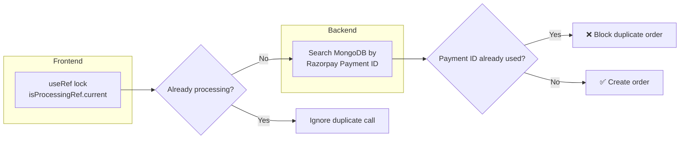

# 🛒 NexusCart-AI

> A Production-Ready MERN E-Commerce Backend built with Node.js, Express.js, MongoDB, Joi Validation, and Cloudinary.

---

## 🚀 Project Overview

**NexusCart-AI** is a scalable E-Commerce backend focused on clean architecture, security, and production-ready coding practices.

The goal of this project is to build an industry-standard backend by following best practices used in real-world MERN applications.

---

# 🛠️ Tech Stack

* Node.js
* Express.js
* MongoDB
* Mongoose
* Joi Validation
* Dotenv
* Cloudinary *(Integration Coming Soon)*
* Multer *(Integration Coming Soon)*

---

# ✅ Features Completed

## ✔ Express Server Setup

* Express Application
* Environment Variables
* MongoDB Connection
* API Routing

---

## ✔ MongoDB Integration

* Mongoose Connected
* Database Configuration
* Environment-based Connection

---

## ✔ Product Model

Implemented Product Schema with:

* Product Name
* Description
* Price
* Category
* Stock
* Ratings
* Images
* Reviews
* Created By (User)
* Automatic Timestamps

---

## ✔ Joi Validation

Implemented request validation for:

* Product Name
* Description
* Price
* Category
* Stock

Validation occurs before the controller executes.

---

## ✔ Validation Middleware

Created a reusable validation middleware.

Responsibilities:

* Validate Request Body
* Return HTTP 400 on validation failure
* Return all validation errors together
* Prevent invalid requests from reaching controllers

---

## ✔ Async Handler

Reusable async wrapper to eliminate repetitive `try...catch` blocks in controllers.

Benefits:

* Cleaner Controllers
* Automatic Promise Error Handling
* Easy Maintenance

---

## ✔ Global Error Handler

Implemented centralized error middleware.

Responsibilities:

* Handle application errors
* Return consistent JSON responses
* Support custom status codes

---

## ✔ Custom Error Class

Created reusable `ErrorHandler` class.

Benefits:

* Custom Status Codes
* Better Error Management
* Cleaner Controller Logic

---

## ✔ Create Product API

Endpoint:

```http
POST /api/v1/products
```

Current Flow:

```text
Client
   │
   ▼
Express Route
   │
   ▼
Joi Validation
   │
   ▼
Controller
   │
   ▼
MongoDB
   │
   ▼
JSON Response
```

---

# 📌 Current Architecture

```text
Client
   │
   ▼
Routes
   │
   ▼
Validation Middleware
   │
   ▼
Controller
   │
   ▼
MongoDB
   │
   ▼
Success Response
```

Error Flow:

```text
Client
   │
   ▼
Routes
   │
   ▼
Controller
   │
   ▼
Async Handler
   │
   ▼
Global Error Middleware
   │
   ▼
JSON Error Response
```

---

# 🚧 Upcoming Features

* Multer Integration
* Cloudinary Image Upload
* Update Product API
* Delete Product API
* Get All Products API
* Get Single Product API
* Search
* Filtering
* Pagination
* Sorting
* JWT Authentication
* Role-Based Authorization (Admin/User)
* User Module
* Cart Module
* Wishlist Module
* Orders Module
* Reviews & Ratings
* Payment Gateway Integration
* Security (Helmet, Rate Limiting, CORS)

---

# 📌 Project Goal

Build a production-ready MERN E-Commerce backend following clean architecture, scalable design, and industry best practices.

---
# 🛒 NexusCart-AI Backend

A production-ready MERN E-Commerce backend built with **Node.js**, **Express.js**, and **MongoDB**, following clean architecture and scalable development practices.

---

## 🚀 Tech Stack

* Node.js
* Express.js
* MongoDB
* Mongoose
* Joi Validation
* Dotenv

---


---

# ✅ Features Completed

## Server Setup

* Express Server
* Environment Variables
* MongoDB Connection
* API Routing

---

## Product Model

Implemented a production-ready Product model with:

* Product Name
* Description
* Price
* Category
* Stock
* Ratings
* Number of Reviews
* Images
* Embedded Review Schema
* Admin/User Reference
* Automatic Timestamps

---

## Joi Validation

Created reusable validation for Product APIs.

Validated Fields:

* Name
* Description
* Price
* Category
* Stock

---

## Validation Middleware

Reusable middleware that:

* Validates request body
* Returns HTTP 400 for invalid requests
* Returns all validation errors together
* Prevents invalid data from reaching controllers

---

## Async Handler

Implemented reusable async wrapper for controllers.

Benefits:

* Removes repetitive try-catch blocks
* Automatically forwards errors to Express error middleware
* Cleaner controller code

---

## Global Error Handler

Implemented centralized error middleware for consistent API error responses.

---

## Custom Error Handler

Created reusable ErrorHandler class for custom application errors and status codes.

---

# Product APIs Completed

### Create Product

```http
POST /api/v1/products
```

Creates a new product after successful validation.

---

### Get All Products

```http
GET /api/v1/products
```

Returns all available products.

---

### Get Single Product

```http
GET /api/v1/product/:id
```

Returns a single product by its ID.

Returns **404** if the product does not exist.

---

# Current Backend Flow

```text
Client
   │
   ▼
Routes
   │
   ▼
Validation Middleware
   │
   ▼
Controller
   │
   ▼
MongoDB
   │
   ▼
JSON Response
```

Error Flow

```text
Controller
   │
   ▼
Async Handler
   │
   ▼
Error Middleware
   │
   ▼
JSON Error Response
```

---

# 🚧 Upcoming Features

* Update Product API
* Delete Product API
* Multer Integration
* Cloudinary Image Upload
* JWT Authentication
* Role-Based Authorization
* Search
* Filter
* Pagination
* Sorting
* Product Reviews
* Order Management
* Payment Integration

---
# 🛒 NexusCart-AI Backend

A production-ready MERN E-Commerce backend built using **Node.js**, **Express.js**, and **MongoDB**, following clean architecture and scalable backend development practices.

---

# 🚀 Tech Stack

* Node.js
* Express.js
* MongoDB
* Mongoose
* Joi Validation
* Dotenv


---

# ✅ Features Implemented

## 1. Express Server Setup

* Express Application
* Environment Variables
* MongoDB Connection
* API Routing

---

## 2. Product Model

Designed a production-ready Product schema with:

* Product Name
* Description
* Price
* Category
* Stock
* Ratings
* Number of Reviews
* Images
* Embedded Review Schema
* User Reference
* Automatic Timestamps

---

## 3. Embedded Review Schema

Created a reusable Review Schema inside the Product model.

Each review stores:

* User
* Name
* Rating
* Comment

---

## 4. Joi Validation

Implemented reusable request validation.

Validated fields:

* Product Name
* Description
* Price
* Category
* Stock

---

## 5. Validation Middleware

Created a reusable middleware that:

* Validates request body
* Returns HTTP 400 on invalid data
* Prevents invalid requests from reaching controllers
* Returns all validation errors together

---

## 6. Async Handler

Implemented reusable async wrapper for Express controllers.

Benefits:

* Removes repetitive try-catch blocks
* Automatically forwards rejected promises to the global error handler
* Keeps controllers clean and readable

---

## 7. Global Error Handling

Implemented centralized error handling using:

* Custom ErrorHandler Class
* Global Error Middleware

Provides consistent JSON error responses across the application.

---

# 📦 Product APIs

## Create Product

```http
POST /api/v1/products
```

Creates a new product after validating the request.

---

## Get All Products

```http
GET /api/v1/products
```

Returns all products from the database.

Supports:

* Search
* Filter
* Sort
* Pagination

---

## Get Single Product

```http
GET /api/v1/product/:id
```

Returns product details using Product ID.

Returns **404** if the product does not exist.

---

# 🔍 API Features

A reusable `APIFunctionality` class has been implemented to keep controllers clean and scalable.

---

## Search

Supports keyword search using MongoDB Regular Expressions.

Example:

```http
GET /api/v1/products?keyword=iphone
```

Searches product names in a case-insensitive manner.

---

## Filter

Supports advanced filtering.

Examples:

```http
GET /api/v1/products?category=Mobiles
```

```http
GET /api/v1/products?price[gte]=50000
```

```http
GET /api/v1/products?price[lte]=100000
```

```http
GET /api/v1/products?ratings[gte]=4
```

---

## Sort

Supports dynamic sorting.

Examples:

```http
GET /api/v1/products?sort=price
```

```http
GET /api/v1/products?sort=-price
```

```http
GET /api/v1/products?sort=ratings
```

Default sorting:

```text
Newest Products First
```

---

## Pagination

Supports paginated responses.

Example:

```http
GET /api/v1/products?page=2
```

Returns:

* Current Page
* Total Pages
* Products Per Page
* Total Filtered Products

---

# 🔄 Request Flow

```text
Client
   │
   ▼
Express Route
   │
   ▼
Validation Middleware
   │
   ▼
Controller
   │
   ▼
API Functionality
(Search → Filter → Sort → Pagination)
   │
   ▼
MongoDB
   │
   ▼
JSON Response
```

---

# ⚠ Error Flow

```text
Controller
   │
   ▼
Async Handler
   │
   ▼
Global Error Middleware
   │
   ▼
JSON Error Response
```

---

# 🚧 Upcoming Features

* Update Product API
* Delete Product API
* Multer Integration
* Cloudinary Image Upload
* JWT Authentication
* Role-Based Authorization
* User Module
* Product Reviews API
* Cart Module
* Wishlist Module
* Order Management
* Payment Gateway Integration

---

# 🎯 Learning Outcomes

Through this module, the following backend concepts have been implemented and understood:

* REST API Design
* CRUD Operations
* Express Routing
* Middleware Architecture
* MongoDB & Mongoose
* Schema Design
* Embedded Documents
* Joi Validation
* Global Error Handling
* Async Controller Pattern
* Search using Regex
* Dynamic Filtering
* Sorting
* Pagination
* Reusable Utility Classes
* Clean Backend Architecture

---
# 🔐 NexusCart AI - Authentication Module

A production-ready authentication system built using **Node.js**, **Express.js**, **MongoDB**, **JWT**, **Passport.js**, and **Google OAuth 2.0**.

This module is designed with scalability and security in mind, following industry-standard authentication practices.

---

## 🚀 Features

### ✅ User Authentication

* User Registration
* User Login
* Secure Password Hashing using **bcryptjs**
* JWT Token Generation
* HttpOnly Cookie Authentication
* Protected Routes Ready
* Google OAuth 2.0 Login (Passport.js)

---

## 🔒 Security Features

* Password Hashing with bcryptjs
* JWT Authentication
* HttpOnly Cookies
* Secure Cookie Support (Production)
* SameSite Cookie Protection
* Email Validation
* Environment Variables for Secrets
* Production Ready Authentication Flow

---

## 🌐 Google OAuth Features

* Sign in with Google
* Automatic User Registration
* Existing User Login
* Account Linking using Email
* Google Profile Picture Support
* Verified Google Email Support
* Google ID Storage
* Provider Tracking

---

## 🛠️ Tech Stack

* Node.js
* Express.js
* MongoDB
* Mongoose
* Passport.js
* Passport Google OAuth 2.0
* JWT (jsonwebtoken)
* bcryptjs
* Validator
* dotenv

---


---

## ⚙️ Authentication Flow

### Email & Password Authentication

```text
User Register
      │
      ▼
Validate Input
      │
      ▼
Hash Password
      │
      ▼
Store User in MongoDB
      │
      ▼
Generate JWT
      │
      ▼
Send HttpOnly Cookie
      │
      ▼
User Logged In
```

---

### Google OAuth Flow

```text
User
      │
      ▼
Continue with Google
      │
      ▼
Google Authentication
      │
      ▼
Passport Google Strategy
      │
      ▼
Check Existing User
      │
      ├── User Exists
      │       │
      │       ▼
      │    Login
      │
      └── New User
              │
              ▼
      Create Account
              │
              ▼
        Generate JWT
              │
              ▼
     Send HttpOnly Cookie
```

---

## 📦 Environment Variables

```env
PORT=8000

MONGO_URI=your_mongodb_connection

JWT_SECRET=your_super_secret_key
JWT_EXPIRE=7d

COOKIE_EXPIRE=7

NODE_ENV=development

GOOGLE_CLIENT_ID=your_google_client_id
GOOGLE_CLIENT_SECRET=your_google_client_secret
GOOGLE_CALLBACK_URL=http://localhost:8000/api/v1/auth/google/callback
```

---

## 📡 API Endpoints

### Authentication

| Method | Endpoint                       | Description           |
| ------ | ------------------------------ | --------------------- |
| POST   | `/api/v1/auth/register`        | Register New User     |
| POST   | `/api/v1/auth/login`           | Login User            |
| GET    | `/api/v1/auth/google`          | Google Login          |
| GET    | `/api/v1/auth/google/callback` | Google OAuth Callback |

---

## ✨ Highlights

* Production-ready authentication architecture
* JWT-based authentication
* Google OAuth integration
* Secure password hashing
* Account linking support
* HttpOnly cookie authentication
* Clean project structure
* Reusable token utility
* Environment-based configuration
* Industry-standard security practices

---

## 🚧 Upcoming Features

* Logout
* Forgot Password
* Reset Password
* Email Verification
* Update Profile
* Change Password
* Role-Based Authorization (Admin/User)
* Refresh Token Authentication
* Redis Session Management
* Two-Factor Authentication (2FA)
* AI-Powered Security Features

---
# 🔐 NexusCart AI - Authentication Module

A production-ready authentication system built with **Node.js**, **Express.js**, **MongoDB**, **JWT**, **Passport.js**, and **Google OAuth 2.0**.

This module follows modern authentication practices and is designed with security, scalability, and maintainability in mind.

---

# ✨ Features

## 👤 User Authentication

* User Registration
* User Login
* Secure Password Hashing using **bcryptjs**
* JWT Authentication
* HttpOnly Cookie Authentication
* Protected Routes
* Logout Ready

---

## 🌍 Google OAuth 2.0 Authentication

* Continue with Google
* Automatic Google Account Registration
* Google Login
* Existing Account Linking
* Google Profile Image Support
* Google Email Verification
* Google ID Storage
* OAuth Provider Tracking

---

## 🔐 Password Security

* Password Hashing using bcrypt
* Password Comparison Method
* Secure JWT Token Generation
* HttpOnly Cookies
* SameSite Cookie Protection
* Secure Cookies in Production
* Environment Variable Based Secrets

---

## 🔑 Forgot Password & Reset Password

* Forgot Password API
* Secure Reset Token Generation
* SHA-256 Token Hashing
* 15 Minute Token Expiry
* Password Reset Email
* One-Time Reset Token
* Automatic Token Cleanup
* Automatic Login After Password Reset

---

## 📧 Email Service

* Nodemailer Integration
* Gmail SMTP Support
* Dynamic Email Sender
* Plain Text Email Support
* HTML Email Ready
* Reusable Email Utility

---

# 🛠️ Tech Stack

* Node.js
* Express.js
* MongoDB
* Mongoose
* Passport.js
* Passport Google OAuth 2.0
* JWT (jsonwebtoken)
* bcryptjs
* Validator
* Nodemailer
* Crypto
* dotenv

---

# 🔄 Authentication Flow

## Email & Password Login

```text
User
   │
   ▼
Register
   │
   ▼
Validate Data
   │
   ▼
Hash Password
   │
   ▼
Save User
   │
   ▼
Generate JWT
   │
   ▼
HttpOnly Cookie
   │
   ▼
Authenticated
```

---

## Google OAuth Flow

```text
User
   │
   ▼
Continue with Google
   │
   ▼
Google Authentication
   │
   ▼
Passport Google Strategy
   │
   ▼
Find Existing User
   │
   ├───────────────┐
   ▼               ▼
User Exists     New User
   │               │
   ▼               ▼
 Login       Create Account
        │
        ▼
Generate JWT
        │
        ▼
HttpOnly Cookie
        │
        ▼
Authenticated
```

---

## Forgot Password Flow

```text
User
   │
   ▼
Forgot Password
   │
   ▼
Find User
   │
   ▼
Generate Reset Token
   │
   ▼
Hash Token
   │
   ▼
Save Token in Database
   │
   ▼
Send Reset Email
   │
   ▼
User Receives Email
```

---

## Reset Password Flow

```text
User Opens Email
        │
        ▼
Reset Link
        │
        ▼
Verify Reset Token
        │
        ▼
Check Expiry
        │
        ▼
Update Password
        │
        ▼
Hash Password
        │
        ▼
Delete Reset Token
        │
        ▼
Generate JWT
        │
        ▼
Login Successfully
```

---

# 📦 Environment Variables

```env
PORT=8000

NODE_ENV=development

MONGO_URI=your_mongodb_connection_string

JWT_SECRET=your_super_secret_key
JWT_EXPIRE=7d
COOKIE_EXPIRE=7

GOOGLE_CLIENT_ID=your_google_client_id
GOOGLE_CLIENT_SECRET=your_google_client_secret
GOOGLE_CALLBACK_URL=http://localhost:8000/api/v1/auth/google/callback

SMTP_HOST=smtp.gmail.com
SMTP_PORT=465
SMTP_SERVICE=gmail

SMTP_MAIL=your_email@gmail.com
SMTP_PASSWORD=your_google_app_password

SMTP_FROM_NAME=NexusCart AI
```

---

# 📡 Authentication APIs

| Method | Endpoint                             | Description           |
| ------ | ------------------------------------ | --------------------- |
| POST   | `/api/v1/auth/register`              | Register User         |
| POST   | `/api/v1/auth/login`                 | Login User            |
| GET    | `/api/v1/auth/google`                | Google Login          |
| GET    | `/api/v1/auth/google/callback`       | Google OAuth Callback |
| POST   | `/api/v1/auth/password/forgot`       | Forgot Password       |
| PUT    | `/api/v1/auth/password/reset/:token` | Reset Password        |

---

# 🔒 Security Features

* JWT Based Authentication
* HttpOnly Cookies
* Secure Cookie Configuration
* Password Hashing (bcrypt)
* SHA-256 Reset Token Hashing
* Email Validation
* Google OAuth 2.0
* One-Time Password Reset Tokens
* Reset Token Expiration
* Account Linking
* Environment Variable Configuration
* Async Error Handling
* Centralized Error Handling

---

# 🚀 Future Improvements

* Email Verification
* Refresh Token Authentication
* Role-Based Authorization
* Multi-Factor Authentication (2FA)
* Session Management with Redis
* Login Rate Limiting
* Account Lock After Failed Attempts
* Device Management
* Login History
* Email Templates
* OTP Login
* Password Strength Checker

---

# 📌 Learning Outcomes

During this module, the following concepts were implemented:

* JWT Authentication
* Cookie-Based Authentication
* Google OAuth 2.0
* Passport.js Integration
* Password Hashing
* Password Verification
* Authentication Middleware
* Protected Routes
* Forgot Password Workflow
* Password Reset Workflow
* Secure Token Generation
* SHA-256 Hashing
* SMTP Email Integration
* Nodemailer
* Environment Variables
* Secure Authentication Architecture

---
# 🛡️ Role-Based Access Control (RBAC)

A secure Role-Based Access Control (RBAC) system implemented using **JWT Authentication**, **Express Middleware**, and **MongoDB** to protect sensitive API endpoints.

This module ensures that only authorized users can access protected resources while restricting administrative operations to users with the **Admin** role.

---

# ✨ Features

* JWT Authentication Middleware
* Protected Routes
* Role-Based Authorization
* Admin Only Routes
* Public Routes
* Secure Route Chaining
* Reusable Authorization Middleware
* Scalable Role Management

---

# 👥 User Roles

Currently the application supports two roles:

| Role  | Permissions                                      |
| ----- | ------------------------------------------------ |
| User  | View products and access customer features       |
| Admin | Full product management (Create, Update, Delete) |

---

# 🔐 Authentication Middleware

The `isAuthenticatedUser` middleware is responsible for:

* Reading JWT from HttpOnly Cookies
* Supporting Bearer Token Authentication
* Verifying JWT
* Fetching User from Database
* Attaching User to `req.user`
* Blocking Unauthorized Requests

Authentication Flow

```text
Client Request
       │
       ▼
Read JWT Token
       │
       ▼
Verify JWT
       │
       ▼
Find User
       │
       ▼
Attach User to req.user
       │
       ▼
Next Middleware
```

---

# 👑 Authorization Middleware

The `authorizeRoles()` middleware checks whether the authenticated user has permission to access a specific resource.

Supported Features:

* Single Role Authorization
* Multiple Role Authorization
* Reusable Middleware
* HTTP 403 Forbidden Response
* Dynamic Role Checking

Example:

```javascript
authorizeRoles("admin")
```

or

```javascript
authorizeRoles("admin", "seller")
```

Authorization Flow

```text
Authenticated User
        │
        ▼
Read req.user.role
        │
        ▼
Role Allowed?
     │         │
    Yes       No
     │         │
     ▼         ▼
 Continue   403 Forbidden
```

---

# 🔄 Middleware Execution Order

Every protected route follows this execution pipeline:

```text
Client Request
       │
       ▼
isAuthenticatedUser
       │
       ▼
authorizeRoles()
       │
       ▼
Request Validation
       │
       ▼
Controller
       │
       ▼
Database
       │
       ▼
Response
```

Execution Order:

1. Authenticate User
2. Check User Role
3. Validate Request Body
4. Execute Controller Logic

---

# 🌐 Public Routes

Accessible without authentication.

| Method | Endpoint               |
| ------ | ---------------------- |
| GET    | `/api/v1/products`     |
| GET    | `/api/v1/products/:id` |

---

# 🔒 Protected Admin Routes

Require both authentication and admin privileges.

| Method | Endpoint               | Access |
| ------ | ---------------------- | ------ |
| POST   | `/api/v1/products`     | Admin  |
| PUT    | `/api/v1/products/:id` | Admin  |
| DELETE | `/api/v1/products/:id` | Admin  |

---

# 📂 Middleware Structure

```text
middlewares/
│
├── auth.js
│     ├── isAuthenticatedUser()
│     └── authorizeRoles()
│
├── asyncHandler.js
│
├── validate.js
│
└── error.js
```

---

# 🔐 Security Features

* JWT Token Verification
* HttpOnly Cookie Authentication
* Bearer Token Support
* Protected API Endpoints
* Admin Authorization
* Dynamic Role Validation
* Unauthorized Access Protection
* Forbidden Resource Protection

---

# 🚀 Benefits

* Clean Middleware Architecture
* Reusable Authorization Logic
* Easy to Extend with New Roles
* Production Ready Route Protection
* Separation of Authentication & Authorization
* Follows Industry Best Practices

---

# 📈 Future Enhancements

Additional roles can be added easily:

* Admin
* Seller
* Customer
* Moderator
* Delivery Partner
* Support Agent

Example:

```javascript
authorizeRoles("admin", "seller", "moderator")
```

---

# 📚 Concepts Covered

This module demonstrates the following backend concepts:

* JWT Authentication
* Authentication Middleware
* Authorization Middleware
* Role-Based Access Control (RBAC)
* Express Middleware Chaining
* Route Protection
* Secure API Design
* Permission Management
* Admin Panel Security
* Express Routing Best Practices

---
# 🛡️ API Security Layer (Helmet + Rate Limiting)

A production-ready API security module built using **Helmet.js** and **Express Rate Limit** to protect the backend against common web attacks, brute-force attempts, API abuse, and denial-of-service attacks.

This security layer is designed following industry-standard backend security practices and provides multiple layers of protection for public and authenticated APIs.

---

# 🚀 Features

## 🪖 Helmet Security

* Secure HTTP Response Headers
* Clickjacking Protection
* MIME Sniffing Protection
* Cross-Site Scripting (XSS) Mitigation
* Browser Security Enhancements
* Information Leakage Prevention
* Secure Defaults for Express Applications

---

## 🚦 API Rate Limiting

* Global API Rate Limiter
* Authentication Rate Limiter
* Password Reset Rate Limiter
* IP-Based Request Limiting
* Brute Force Protection
* Email Spam Prevention
* Route-Specific Rate Limiting
* Reusable Middleware Architecture

---

# 🛡️ Why Helmet?

Helmet automatically configures secure HTTP headers to reduce common web vulnerabilities without requiring manual header configuration.

### Helmet protects against:

* Clickjacking Attacks
* MIME Type Sniffing
* Browser Information Disclosure
* Cross-Site Scripting (XSS)
* Unsafe Browser Defaults

---

# 🚦 Why Rate Limiting?

Without rate limiting, attackers can:

* Perform brute-force login attacks
* Spam forgot password emails
* Flood backend APIs
* Overload the server
* Launch denial-of-service attempts
* Consume backend resources

Rate limiting restricts how many requests a single IP can make within a defined time window.

---

# 📊 Implemented Rate Limiters

## 🔐 Authentication Limiter

Applied On:

* Register
* Login

Configuration

* Window: **15 Minutes**
* Maximum Requests: **10**

Purpose

* Prevent Brute Force Attacks
* Reduce Fake Registrations
* Protect Authentication Endpoints

---

## 🔑 Password Reset Limiter

Applied On:

* Forgot Password

Configuration

* Window: **15 Minutes**
* Maximum Requests: **5**

Purpose

* Prevent Email Spamming
* Prevent Password Reset Abuse
* Protect SMTP Resources

---

## 🌍 Global API Limiter

Applied On:

```text id="99j0ng"
/api/v1/*
```

Configuration

* Window: **15 Minutes**
* Maximum Requests: **300**

Purpose

* Prevent API Abuse
* Protect Server Resources
* Improve Backend Stability

---

# 📂 Project Structure

```text id="9jlwmw"
backend/
│
├── middlewares/
│   ├── auth.js
│   ├── asyncHandler.js
│   ├── validate.js
│   ├── error.js
│   └── rateLimiter.js
│
├── app.js
│
└── routes/
    ├── authRoutes.js
    └── productRoutes.js
```

---

# 🔄 Security Middleware Flow

```text id="dvlm9t"
Incoming Request
        │
        ▼
Helmet Security
        │
        ▼
Global API Rate Limiter
        │
        ▼
Authentication Rate Limiter (If Required)
        │
        ▼
JWT Authentication
        │
        ▼
Role-Based Authorization
        │
        ▼
Request Validation
        │
        ▼
Controller
        │
        ▼
Database
        │
        ▼
Response
```

---

# 🌐 Route Protection

## Public APIs

| Method | Endpoint               |
| ------ | ---------------------- |
| GET    | `/api/v1/products`     |
| GET    | `/api/v1/products/:id` |

---

## Authentication APIs

| Method | Endpoint                       | Protection             |
| ------ | ------------------------------ | ---------------------- |
| POST   | `/api/v1/auth/register`        | Auth Limiter           |
| POST   | `/api/v1/auth/login`           | Auth Limiter           |
| POST   | `/api/v1/auth/password/forgot` | Password Reset Limiter |

---

## Protected APIs

Protected using:

* JWT Authentication
* Role-Based Authorization
* Request Validation
* Global API Limiter

---

# 🔐 Security Benefits

## Helmet

* Secure HTTP Headers
* Reduced Browser-Based Attacks
* Better Production Readiness
* Improved Client Security
* Lower Attack Surface

---

## Rate Limiting

* Brute Force Prevention
* API Abuse Protection
* Email Spam Prevention
* DoS Mitigation
* Resource Protection
* Stable API Performance

---


---

# ⚙️ Middleware Execution Order

```text id="yzvnft"
Client Request
       │
       ▼
Helmet
       │
       ▼
Global Rate Limiter
       │
       ▼
Authentication Rate Limiter
       │
       ▼
JWT Authentication
       │
       ▼
Authorization (RBAC)
       │
       ▼
Request Validation
       │
       ▼
Business Logic
       │
       ▼
Database
       │
       ▼
Response
```

---

# 📚 Concepts Covered

This module demonstrates the implementation of:

* Helmet.js
* Express Rate Limit
* API Security
* HTTP Security Headers
* IP-Based Rate Limiting
* Route-Specific Middleware
* Authentication Protection
* Brute Force Prevention
* Email Spam Prevention
* Middleware Chaining
* Secure Express Architecture
* Production Backend Security

---

# 🚀 Future Improvements

* Redis-Based Distributed Rate Limiting
* Dynamic User-Based Limits
* Sliding Window Algorithm
* IP Blacklisting
* Device-Based Rate Limiting
* Cloudflare / WAF Integration
* Security Monitoring Dashboard
* Request Analytics
* CAPTCHA Integration
* API Key Rate Limiting

---

# 🎯 Learning Outcomes

During this module, the following concepts were implemented:

* Helmet Security Middleware
* Secure HTTP Headers
* Express Rate Limiting
* Global API Protection
* Route-Specific Rate Limiting
* Authentication Endpoint Protection
* Password Reset Protection
* Middleware Architecture
* IP-Based Request Limiting
* Express Security Best Practices
* Production API Hardening
* Scalable Security Design

---
# 👤 Product Ownership & Admin Authorization

This module ensures that only authenticated administrators can create, update, and delete products while automatically tracking the creator of each product.

## ✨ Features

* JWT Protected Product Management
* Role-Based Product Access (Admin Only)
* Automatic Product Ownership
* User Reference using MongoDB ObjectId
* Product Creator Tracking
* Secure Backend Assignment of Creator ID
* Ownership Ready for Auditing and Analytics

---

## 🔄 Workflow

```text
Admin Login
      │
      ▼
JWT Authentication
      │
      ▼
Role Verification (Admin)
      │
      ▼
Create / Update / Delete Product
      │
      ▼
Assign req.user._id
      │
      ▼
Store Product with Creator Reference
```

---

## 📂 Product Schema

Each product stores the creator's reference using MongoDB ObjectId.

```javascript
user: {
  type: mongoose.Schema.Types.ObjectId,
  ref: "User",
  required: true
}
```

---

## 🔒 Security

* Product ownership is assigned **only by the backend**.
* The client cannot manually choose the product creator.
* Only authenticated users with the **Admin** role can manage products.
* Every product maintains a reference to the admin who created it.

---

## 🚀 Benefits

* Secure Product Management
* Admin Activity Tracking
* Ownership-Based Data Relations
* Easy User Population with `populate()`
* Scalable Architecture for Future Features

---

## 📚 Concepts Covered

* JWT Authentication
* Role-Based Access Control (RBAC)
* MongoDB References
* Mongoose ObjectId
* Express Middleware Chaining
* Backend Data Ownership
* Secure API Design
# 📦 Admin Product Management API

A secure API that allows an authenticated administrator to retrieve **only the products created by their own account**.

## ✨ Features

* Admin-Only Access
* JWT Protected Route
* Fetch Products by Logged-in Admin
* User-Based Product Filtering
* Product Ownership Verification
* Secure Database Query using `req.user.id`

---

## 🔄 Workflow

```text
Admin Login
      │
      ▼
JWT Authentication
      │
      ▼
Role Verification (Admin)
      │
      ▼
Read req.user.id
      │
      ▼
Find Products
(user: req.user.id)
      │
      ▼
Return Admin's Products
```

---

## 📡 API Endpoint

| Method | Endpoint                 | Access               |
| ------ | ------------------------ | -------------------- |
| GET    | `/api/v1/admin/products` | Private (Admin Only) |

---

## 🔒 Security

* Accessible only to authenticated administrators.
* Returns only products created by the logged-in admin.
* Prevents access to products owned by other administrators.
* Uses JWT authentication and MongoDB user references for ownership validation.

---

## 📚 Concepts Covered

* JWT Authentication
* Role-Based Access Control (RBAC)
* MongoDB ObjectId References
* User-Based Data Filtering
* Secure REST API Design
* Mongoose Query Filtering
# 👤 User Profile Management

A secure profile management module that allows authenticated users to view and update their personal information while maintaining account security.

## ✨ Features

* View Logged-in User Profile
* Update User Name
* Update User Email
* JWT Protected Routes
* Request Validation using Joi
* MongoDB Data Validation
* Google Account Email Protection
* Real-Time Profile Updates

---

## 🔄 Workflow

```text id="8cjlwm"
User Login
      │
      ▼
JWT Authentication
      │
      ▼
Access Profile
      │
      ▼
Update Name / Email
      │
      ▼
Validate Request
      │
      ▼
Update Database
      │
      ▼
Return Updated Profile
```

---

## 📡 API Endpoints

| Method | Endpoint                 | Access  |
| ------ | ------------------------ | ------- |
| GET    | `/api/v1/auth/me`        | Private |
| PUT    | `/api/v1/auth/me/update` | Private |

---

## 🔒 Security

* Only authenticated users can update their profile.
* Profile updates are validated before saving.
* Google OAuth users cannot directly change their registered email.
* Updated data is validated using Joi and Mongoose validators.

---

## 📚 Concepts Covered

* JWT Authentication
* Protected Routes
* User Profile Management
* MongoDB Document Updates
* Joi Validation
* Express Middleware
* Secure REST API Design

# 👥 Admin User Management

A secure administration module that enables administrators to manage registered users across the platform. This API provides an overview of all users while protecting sensitive information and restricting access to authorized administrators only.

---

# ✨ Features

* Admin-Only Access
* View All Registered Users
* Total User Count
* Password Hash Exclusion
* Optimized Database Queries using `.lean()`
* JWT Protected Route
* Role-Based Authorization (RBAC)
* Secure User Management

---

# 🔄 Workflow

```text
Admin Login
      │
      ▼
JWT Authentication
      │
      ▼
Role Verification (Admin)
      │
      ▼
Fetch All Users
      │
      ▼
Exclude Password Field
      │
      ▼
Return Users & Total Count
```

---

# 📡 API Endpoint

| Method | Endpoint              | Access               |
| ------ | --------------------- | -------------------- |
| GET    | `/api/v1/admin/users` | Private (Admin Only) |

---

# 🔒 Security

* Accessible only to authenticated administrators.
* Password hashes are excluded using `.select("-password")`.
* User data is optimized with `.lean()` for improved query performance.
* Protected using JWT Authentication and Role-Based Access Control (RBAC).

---

# 🚀 Benefits

* Centralized User Management
* Admin Dashboard Integration
* Secure User Data Exposure
* Faster Query Execution
* Ready for Analytics & Reporting
* Easily Extendable for Future Admin Features

---

# 📚 Concepts Covered

* JWT Authentication
* Role-Based Access Control (RBAC)
* Admin Dashboard APIs
* MongoDB Query Optimization
* Mongoose `.select()`
* Mongoose `.lean()`
* Secure REST API Design
* User Management System


# 👑 Admin Role Management

A secure admin module that allows authorized administrators to update user roles while preventing accidental privilege loss and unauthorized role changes.

## ✨ Features

* Admin-Only Role Management
* Update User Role
* Role Validation using Joi
* Self-Demotion Protection
* JWT Protected Route
* Role-Based Access Control (RBAC)
* Secure User Existence Verification

---

## 🔄 Workflow

```text id="k2w8aq"
Admin Login
      │
      ▼
JWT Authentication
      │
      ▼
Role Verification (Admin)
      │
      ▼
Validate Role
      │
      ▼
Check User Exists
      │
      ▼
Prevent Self-Demotion
      │
      ▼
Update User Role
```

---

## 📡 API Endpoint

| Method | Endpoint                      | Access               |
| ------ | ----------------------------- | -------------------- |
| PUT    | `/api/v1/auth/admin/user/:id` | Private (Admin Only) |

---

## 🔒 Security

* Only authenticated administrators can update user roles.
* Role values are restricted to **`user`** and **`admin`**.
* Prevents administrators from removing their own admin privileges.
* Uses JWT Authentication, RBAC, and Joi Validation for secure role management.

---

## 📚 Concepts Covered

* JWT Authentication
* Role-Based Access Control (RBAC)
* Admin User Management
* Role Validation
* Self-Demotion Protection
* Secure REST API Design

---
# 🗑️ Admin User Deletion

A secure admin-only API that allows authorized administrators to permanently delete user accounts while preventing accidental deletion of their own admin account.

## ✨ Features

* Admin-Only User Deletion
* JWT Authentication
* Role-Based Access Control (RBAC)
* User Existence Validation
* Self-Deletion / Lockout Protection
* Secure Database Deletion
* Centralized Error Handling

---

## 🔄 Workflow

```text id="4k9x2m"
Admin Request
      │
      ▼
JWT Authentication
      │
      ▼
Admin Role Verification
      │
      ▼
Check Self-Deletion
      │
      ▼
Check User Exists
      │
      ▼
Delete User
      │
      ▼
Success Response
```

---

## 📡 API Endpoint

| Method | Endpoint                      | Access               |
| ------ | ----------------------------- | -------------------- |
| DELETE | `/api/v1/auth/admin/user/:id` | Private (Admin Only) |

---

## 🔒 Security

* Only authenticated administrators can delete users.
* An admin cannot delete their own account through this endpoint.
* User existence is verified before deletion.
* Unauthorized users receive a `403 Forbidden` response through RBAC.
* Errors are handled through the centralized error-handling system.

---

## 📚 Concepts Covered

* JWT Authentication
* Role-Based Access Control (RBAC)
* Admin User Management
* Self-Deletion Protection
* MongoDB Document Deletion
* Express Middleware Chaining
* Secure REST API Design

# ⭐ Product Review & Rating System

A production-ready product review and rating system implemented for **NexusCart AI** using **Node.js, Express.js, MongoDB, and Mongoose**.

The system allows authenticated users to add, update, and delete their reviews while providing public access to product reviews. Product ratings and review counts are automatically recalculated whenever reviews are added, updated, or deleted.

---

# 🚀 Features

* ⭐ Add Product Review
* ✏️ Update Existing Review
* 🗑️ Delete Review
* 📋 Get All Reviews of a Product
* 🔐 Authentication-Based Review Actions
* 👤 User-Based Review Ownership
* 🚫 One Review Per User Per Product
* 📊 Automatic Average Rating Calculation
* 🔢 Automatic Review Count
* 🔄 Automatic Rating Recalculation
* 🛡️ Protected Review Operations
* ⚡ Centralized Error Handling
* 🧩 MongoDB Embedded Review Architecture

---

# 🏗️ Review Architecture

Reviews are stored directly inside the corresponding product document.

Example:

```json
{
  "_id": "product_id",
  "name": "Apple MacBook Air M2",
  "ratings": 4.5,
  "numberOfReviews": 2,
  "reviews": [
    {
      "user": "user_id_1",
      "name": "Hardeep Singh",
      "rating": 5,
      "comment": "Excellent product!"
    },
    {
      "user": "user_id_2",
      "name": "Rahul",
      "rating": 4,
      "comment": "Very good laptop."
    }
  ]
}
```

This approach keeps product-specific review data together and makes product detail queries straightforward.

---

# 🔐 Authentication & Review Ownership

Review creation, updating, and deletion are tied to the authenticated user.

The authenticated user's ID is obtained from:

```javascript
req.user.id
```

When creating a review:

```javascript
const review = {
  user: req.user.id,
  name: req.user.name,
  rating: Number(rating),
  comment
};
```

This ensures that the backend determines the review owner instead of trusting a user ID sent by the client.

---

# ⭐ Add / Update Review

## Endpoint

```text
PUT /api/v1/review
```

## Access

```text
Private - Logged-in Users
```

## Request Body

```json
{
  "productId": "PRODUCT_ID",
  "rating": 5,
  "comment": "Awesome product!"
}
```

---

## 🔄 Add Review Flow

```text
User Login
    │
    ▼
JWT Authentication
    │
    ▼
Submit Review
    │
    ▼
Find Product
    │
    ▼
Check Existing Review
    │
    ├───────────────┐
    ▼               ▼
 Existing         New User
 Review
    │               │
    ▼               ▼
 Update          Add Review
    │               │
    └───────┬───────┘
            ▼
    Recalculate Rating
            │
            ▼
    Update Review Count
            │
            ▼
       Save Product
```

---

# 🚫 Duplicate Review Prevention

The system ensures that one user cannot create multiple reviews for the same product.

Before adding a review, the system checks:

```javascript
const isReviewed = product.reviews.find(
  (rev) => rev.user.toString() === req.user.id.toString()
);
```

If a matching user ID is found, the existing review is updated instead of creating another review.

---

# ✏️ Existing Review Update

If the user has already reviewed the product:

```javascript
if (isReviewed) {
  product.reviews.forEach((rev) => {
    if (rev.user.toString() === req.user.id.toString()) {
      rev.rating = rating;
      rev.comment = comment;
    }
  });
}
```

Example:

Before:

```text
Hardeep → ⭐ 5
"Excellent product"
```

User submits:

```text
Rating: 3
Comment: "Product is average."
```

After:

```text
Hardeep → ⭐ 3
"Product is average."
```

A duplicate review is not created.

---

# ➕ New Review Creation

If the user has not previously reviewed the product:

```javascript
product.reviews.push(review);
```

The review count is then updated:

```javascript
product.numberOfReviews = product.reviews.length;
```

---

# 📊 Automatic Average Rating

Every time a review is added or updated, the product's average rating is recalculated.

The system first calculates the total rating:

```javascript
const totalRating = product.reviews.reduce(
  (acc, item) => item.rating + acc,
  0
);
```

Then calculates the average:

```javascript
product.ratings =
  totalRating / product.reviews.length;
```

### Example

Reviews:

```text
5 ⭐
4 ⭐
3 ⭐
```

Total:

```text
5 + 4 + 3 = 12
```

Number of Reviews:

```text
3
```

Average:

```text
12 / 3 = 4
```

Product becomes:

```json
{
  "ratings": 4,
  "numberOfReviews": 3
}
```

---

# 📋 Get Product Reviews

## Endpoint

```text
GET /api/v1/products/reviews?id=PRODUCT_ID
```

## Access

```text
Public
```

Users do not need to be authenticated to view product reviews.

---

## Request

```text
GET /api/v1/products/reviews?id=6a75b99e3b9511178582e2de
```

---

## Response

```json
{
  "success": true,
  "count": 2,
  "reviews": [
    {
      "user": "6a75e214c7b0a10dfd1b97de",
      "name": "Bhumika gaba",
      "rating": 5,
      "comment": "Awesome quality laptop!"
    },
    {
      "user": "6a770ba2e14252911f08623e",
      "name": "Angel",
      "rating": 5,
      "comment": "Bad quality laptop!"
    }
  ]
}
```

---

# 🗑️ Delete Review

Authenticated users can delete their own review.

## Endpoint

```text
DELETE /api/v1/review
```

## Access

```text
Private - Logged-in Users
```

The backend identifies the review using the authenticated user's ID and removes the corresponding review from the product.

---

# 🔄 Delete Review Flow

```text
Logged-in User
      │
      ▼
JWT Authentication
      │
      ▼
Find Product
      │
      ▼
Find User's Review
      │
      ▼
Remove Review
      │
      ▼
Recalculate Rating
      │
      ▼
Update Review Count
      │
      ▼
Save Product
      │
      ▼
Success Response
```

---

# 📉 Rating Recalculation After Delete

The rating is recalculated after deleting a review.

Example:

Before deletion:

```text
Bhumika → ⭐5
Angel   → ⭐5
```

```text
numberOfReviews = 2
ratings = 5
```

After Bhumika's review is deleted:

```text
Angel → ⭐5
```

Database becomes:

```json
{
  "ratings": 5,
  "numberOfReviews": 1
}
```

This keeps the product's rating data synchronized with the actual reviews.

---

# 🧩 Review Data Structure

Each review contains:

| Field     | Description                           |
| --------- | ------------------------------------- |
| `user`    | ID of the user who created the review |
| `name`    | User name stored with the review      |
| `rating`  | Numeric product rating                |
| `comment` | User's review/comment                 |

Example:

```json
{
  "user": "6a75e214c7b0a10dfd1b97de",
  "name": "Bhumika gaba",
  "rating": 5,
  "comment": "Awesome quality laptop!"
}
```

---

# 🔒 Security

The review system uses authenticated user information rather than trusting ownership data from the client.

### Security principles implemented:

* JWT Authentication
* User Identity from `req.user`
* Review Ownership Tracking
* Protected Add Review API
* Protected Update Review API
* Protected Delete Review API
* Public Review Reading
* Centralized Error Handling
* Backend-Controlled User ID

The client does not decide which user owns a review.

---

# 🛡️ Error Handling

The module handles common scenarios such as:

### Product Not Found

```json
{
  "success": false,
  "message": "Product not found"
}
```

### Missing Product ID

```json
{
  "success": false,
  "message": "Please provide product ID in query parameters (?id=...)"
}
```

### Unauthorized Request

Authentication middleware prevents unauthenticated users from accessing protected review operations.

---

# 📡 API Summary

| Method | Endpoint                                 | Access  | Purpose             |
| ------ | ---------------------------------------- | ------- | ------------------- |
| PUT    | `/api/v1/review`                         | Private | Add / Update Review |
| GET    | `/api/v1/products/reviews?id=PRODUCT_ID` | Public  | Get Product Reviews |
| DELETE | `/api/v1/review`                         | Private | Delete Review       |

---

# 🧠 Complete System Flow

```text
                 PRODUCT
                    │
                    ▼
             Product Details
                    │
                    ▼
                Reviews
                    │
       ┌────────────┼────────────┐
       ▼            ▼            ▼
      Add          Get         Delete
       │            │            │
       ▼            ▼            ▼
 Authenticate     Public     Authenticate
       │            │            │
       ▼            ▼            ▼
 Check Existing   Return      Find User
       │          Reviews       Review
   ┌───┴───┐        │            │
   ▼       ▼        │            ▼
 Exists   New       │         Remove
   │       │        │            │
 Update   Push      │            ▼
   └───┬───┘        │       Recalculate
       │            │            │
       └────────────┼────────────┘
                    ▼
            Recalculate Rating
                    │
                    ▼
              Save Product
```

---

# ⚡ Performance Considerations

Reviews are embedded inside the product document.

### Advantages

* Product + reviews can be fetched together.
* Simple product detail queries.
* No additional review collection lookup required.
* Easy rating calculation.

### Consideration

For extremely high-scale systems with millions of reviews per product, a separate `Review` collection may be more appropriate.

For the current NexusCart AI architecture, embedded reviews provide a simple and effective design.

---

# 🚀 Future Improvements

Possible enhancements for the review system:

* Review Pagination
* Review Sorting
* Helpful / Not Helpful Votes
* Review Images
* Verified Purchase Badge
* Review Moderation
* Admin Review Deletion
* Review Reporting
* Review Replies
* Rating Distribution

Example future rating distribution:

```text
5 ⭐ █████████████████ 70%
4 ⭐ ████████          20%
3 ⭐ ███                7%
2 ⭐                   2%
1 ⭐                   1%
```

---

# 📚 Concepts Covered

This module demonstrates:

* REST API Design
* JWT Authentication
* User-Based Authorization
* MongoDB Embedded Documents
* Mongoose Queries
* Array Operations
* `find()`
* `forEach()`
* `push()`
* `reduce()`
* Dynamic Average Calculation
* CRUD Operations
* Review Ownership
* Data Consistency
* Error Handling
* API Security

---

# 🎯 Learning Outcome

By implementing this module, the backend now supports a complete real-world product review system where users can:

* Add reviews
* Update their reviews
* Delete their reviews
* View product reviews
* Maintain one review per product
* Automatically calculate product ratings
* Automatically maintain review counts

The system is structured to be easily extended with advanced e-commerce review features in the future.

---

# 🛒 Order Management System

A production-oriented **Order Management System** implemented for **NexusCart AI** using **Node.js, Express.js, MongoDB, and Mongoose**.

This module handles the complete order lifecycle — from creating an order and validating products/stock to viewing orders, admin order management, status updates, cancellation, and inventory restoration.

---

# 🚀 Features

* 🛒 Create New Order
* 👤 User-Specific Orders
* 📦 Get Logged-in User's Orders
* 🔍 Get Single Order Details
* 👑 Admin Get All Orders
* 🔄 Admin Update Order Status
* ❌ Cancel Order
* 📦 Automatic Stock Restoration on Cancellation
* 🗑️ Admin Order Deletion
* 🔐 JWT Authentication
* 🛡️ Role-Based Access Control
* 🔒 Order Ownership Authorization
* 💰 Server-Side Price Verification
* 🚫 Duplicate Order Prevention using Payment ID
* 📊 Automatic Total Price Calculation
* 📦 Automatic Inventory Management
* ⚡ Centralized Error Handling

---

# 🏗️ Order Architecture

The order system is divided into user and admin operations.

```text
                         ORDER MANAGEMENT
                                │
              ┌─────────────────┴─────────────────┐
              │                                   │
             USER                                ADMIN
              │                                   │
      ┌───────┼────────┐                 ┌────────┼────────┐
      │       │        │                 │        │        │
    Create   My     Single            All Orders Update   Delete
    Order   Orders   Order             Orders   Status   Order
      │       │        │                 │        │        │
      └───────┴────────┘                 └────────┴────────┘
              │                                   │
              └──────────────┬────────────────────┘
                             ▼
                       Order Database
```

---


---

# 🔐 Authentication & Authorization

Protected order APIs use JWT authentication.

```text
Request
   ↓
JWT Token
   ↓
isAuthenticatedUser
   ↓
req.user
   ↓
Controller
```

Admin-only routes add another layer:

```text
isAuthenticatedUser
        ↓
authorizeRoles("admin")
        ↓
Admin Controller
```

This ensures that normal users cannot access administrative order operations.

---

# 🛒 1. Create New Order

## Endpoint

```text
POST /api/v1/order/new
```

## Access

```text
Private - Logged-in User
```

---

## Request Body

```json
{
  "shippingInfo": {
    "address": "Model Town, Street No 4",
    "city": "Yamunanagar",
    "state": "Haryana",
    "country": "India",
    "pinCode": "135001",
    "phoneNo": "9876543210"
  },
  "orderItems": [
    {
      "product": "PRODUCT_ID",
      "quantity": 1,
      "image": "https://example.com/product.jpg"
    }
  ],
  "paymentInfo": {
    "id": "pay_test_001",
    "status": "succeeded"
  },
  "taxPrice": 100,
  "shippingPrice": 0
}
```

---

# 🔒 Server-Side Price Verification

The backend never blindly trusts the product price sent by the frontend.

Instead:

```text
Frontend Product
       ↓
Product ID
       ↓
MongoDB
       ↓
Actual Product Price
       ↓
Backend Calculation
```

For example:

```text
Frontend says:
Price = ₹1

Database says:
Price = ₹99,900

Backend uses:
₹99,900
```

This prevents users from manipulating the request and purchasing products at an unauthorized price.

---

# 📦 Stock Validation

Before creating an order, the backend checks product availability.

```text
Database Stock = 5
Requested Quantity = 3

5 >= 3
     ↓
Stock Available
     ↓
Continue
```

If the requested quantity exceeds available stock:

```text
Database Stock = 5
Requested Quantity = 10

5 < 10
     ↓
Order Rejected
```

Example response:

```json
{
  "success": false,
  "message": "Insufficient stock for product"
}
```

---

# 🚫 Duplicate Order Prevention

The system uses the payment ID as an idempotency mechanism.

```javascript
Order.findOne({
  "paymentInfo.id": paymentInfo.id
});
```

If an order already exists with the same payment ID, another order is not created.

```text
Payment ID
    ↓
Already exists?
    │
 ┌──┴──┐
YES    NO
 │      │
Reject  Create
```

This helps protect against duplicate orders caused by:

* Network retries
* Duplicate frontend requests
* Payment callback retries
* User refreshing/re-submitting a request

---

# 💰 Order Price Calculation

The backend calculates:

```text
Items Price
     +
Tax
     +
Shipping
     =
Total Price
```

Example:

```text
Items Price    = ₹99,900
Tax Price      = ₹17,982
Shipping Price = ₹0
─────────────────────
Total Price    = ₹117,882
```

The final amount is calculated on the server.

---

# 📦 Inventory Update

After a successful order:

```javascript
$inc: {
  stock: -item.quantity
}
```

Example:

```text
Old Stock = 15
Purchased = 1

15 - 1 = 14
```

The product inventory is automatically reduced.

---

# 📋 2. Get My Orders

## Endpoint

```text
GET /api/v1/orders/me
```

## Access

```text
Private - Logged-in User
```

The backend uses:

```javascript
Order.find({
  user: req.user._id
})
```

Therefore users can only retrieve their own orders.

Orders are sorted by:

```javascript
.sort({
  createdAt: -1
})
```

which means the latest orders appear first.

---

## Example Response

```json
{
  "success": true,
  "count": 1,
  "orders": [
    {
      "_id": "ORDER_ID",
      "totalPrice": 117882,
      "orderStatus": "Processing"
    }
  ]
}
```

---

# 🔍 3. Get Single Order

## Endpoint

```text
GET /api/v1/order/:id
```

## Access

```text
Private
```

The backend retrieves the order using:

```javascript
Order.findById(req.params.id)
```

User information can also be populated:

```javascript
.populate("user", "name email")
```

---

# 🔐 Order Ownership Security

A normal user can only view their own order.

The authorization rule is:

```text
Order Owner
      OR
Admin
      ↓
Allowed
```

If a normal user attempts to access another user's order:

```text
403 Unauthorized
```

This prevents ID-based unauthorized access.

---

# 👑 4. Admin — Get All Orders

## Endpoint

```text
GET /api/v1/admin/orders
```

## Access

```text
Private - Admin Only
```

Middleware:

```javascript
isAuthenticatedUser,
authorizeRoles("admin")
```

Admin can use this API to manage orders across the platform.

Typical admin dashboard information can include:

```text
Total Orders
Processing Orders
Shipped Orders
Delivered Orders
Cancelled Orders
Revenue
```

---

# 🔄 5. Admin — Update Order Status

## Endpoint

```text
PUT /api/v1/admin/order/:id
```

## Access

```text
Private - Admin Only
```

Order status represents the order lifecycle.

Example:

```text
Processing
    ↓
Shipped
    ↓
Delivered
```

The admin can update the status according to the business rules implemented by the application.

---

# ❌ 6. Cancel Order

## Endpoint

```text
PUT /api/v1/order/cancel/:id
```

## Access

```text
Private - Logged-in User
```

The cancellation flow verifies that the user is authorized to cancel the order.

Typical flow:

```text
User Request
     ↓
Find Order
     ↓
Verify Ownership
     ↓
Check Cancellation Rules
     ↓
Change Order Status
     ↓
Restore Stock
     ↓
Save Order
```

---

# 📦 Stock Restoration on Cancellation

When an order is cancelled, purchased stock can be returned to inventory.

Example:

```text
Before Order:
Stock = 15

User purchases:
Quantity = 2

After Order:
Stock = 13

Order Cancelled:
Stock = 15
```

Flow:

```text
Order Cancellation
        ↓
Order Items
        ↓
Product IDs
        ↓
Restore Quantities
        ↓
Inventory Updated
```

This prevents inventory from remaining incorrectly reduced after cancellation.

---

# 🗑️ 7. Admin — Delete Order

## Endpoint

```text
DELETE /api/v1/admin/order/:id
```

## Access

```text
Private - Admin Only
```

Only administrators can permanently remove an order record.

Middleware:

```javascript
isAuthenticatedUser,
authorizeRoles("admin")
```

---

# 🛡️ Security Layers

The order management system implements multiple security layers.

## 1. Authentication

```text
JWT
 ↓
isAuthenticatedUser
```

Only authenticated users can access protected endpoints.

---

## 2. Role Authorization

Admin operations require:

```javascript
authorizeRoles("admin")
```

---

## 3. Ownership Authorization

Users can only access their own orders.

```text
req.user._id
      ↓
Compare
      ↓
order.user
```

---

## 4. Server-Side Price Verification

Product prices are retrieved from MongoDB instead of trusting frontend values.

---

## 5. Stock Validation

Orders cannot exceed available inventory.

---

## 6. Payment ID Idempotency

The same payment ID cannot create multiple orders.

---

# 📡 API Summary

| Method | Endpoint                   | Access     | Purpose          |
| ------ | -------------------------- | ---------- | ---------------- |
| POST   | `/api/v1/order/new`        | User       | Create Order     |
| GET    | `/api/v1/orders/me`        | User       | Get My Orders    |
| GET    | `/api/v1/order/:id`        | User/Admin | Get Single Order |
| PUT    | `/api/v1/order/cancel/:id` | User       | Cancel Order     |
| GET    | `/api/v1/admin/orders`     | Admin      | Get All Orders   |
| PUT    | `/api/v1/admin/order/:id`  | Admin      | Update Status    |
| DELETE | `/api/v1/admin/order/:id`  | Admin      | Delete Order     |

---

# 🧪 Testing Checklist

## Order Creation

* [x] Create order
* [x] Product validation
* [x] Stock validation
* [x] Server-side price verification
* [x] Tax calculation
* [x] Shipping calculation
* [x] Total calculation
* [x] Payment information saved
* [x] Stock reduced
* [x] Duplicate payment ID prevented

## User Operations

* [x] Get own orders
* [x] Get single order
* [x] Ownership verification
* [x] Unauthorized order access blocked
* [x] Cancel order
* [x] Stock restoration

## Admin Operations

* [x] Get all orders
* [x] Update order status
* [x] Delete order
* [x] Admin role protection

---

# 🧠 Important Backend Concepts Learned

This module demonstrates several real-world backend concepts:

* REST API Design
* JWT Authentication
* Role-Based Access Control
* Resource Ownership
* MongoDB Queries
* Mongoose Models
* `populate()`
* MongoDB `$inc`
* Inventory Management
* Server-Side Price Calculation
* Idempotency
* Payment Tracking
* Order Lifecycle Management
* Error Handling
* API Security
* Data Validation

---

# 🔄 Complete Order Lifecycle

```text
                   CREATE ORDER
                        │
                        ▼
                 Validate Products
                        │
                        ▼
                  Check Stock
                        │
                        ▼
             Verify DB Product Price
                        │
                        ▼
               Calculate Total
                        │
                        ▼
                 Create Order
                        │
                        ▼
                Reduce Stock
                        │
                        ▼
                  Processing
                        │
                        ▼
                    Shipped
                        │
                        ▼
                   Delivered
                        │
             ┌──────────┴──────────┐
             │                     │
         Cancelled               Delete
             │                     │
             ▼                     ▼
       Restore Stock         Admin Action
```

---

# ⚠️ Production Hardening — Future Improvement

The current implementation contains important production-oriented protections, but the next major improvement should be **MongoDB Transactions**.

Currently, order creation and stock update are separate database operations.

A production transaction can make them atomic:

```text
START TRANSACTION
       ↓
Validate Stock
       ↓
Create Order
       ↓
Reduce Stock
       ↓
Everything Successful?
    ┌──┴──┐
   YES    NO
    │      │
 COMMIT  ROLLBACK
```

Similarly, cancellation can use a transaction:

```text
START TRANSACTION
       ↓
Cancel Order
       ↓
Restore Stock
       ↓
COMMIT
```

This prevents inconsistent states if one database operation succeeds while another fails.

---

# 🎯 Learning Outcome

After implementing this module, NexusCart AI now has a complete order-management foundation supporting:

```text
User
 │
 ├── Create Order
 ├── View My Orders
 ├── View Single Order
 └── Cancel Order
          │
          └── Restore Inventory

Admin
 │
 ├── View All Orders
 ├── View Any Order
 ├── Update Order Status
 └── Delete Order
```

The module combines **authentication, authorization, inventory management, payment tracking, price verification, idempotency, and order lifecycle management** into a single production-oriented e-commerce workflow.

---

# 🚀 Production-Grade Order Management Enhancements

This update upgrades the NexusCart order management system from a basic order workflow to a more **reliable, secure, and production-oriented e-commerce order system**.

---

## 🔥 Features Added

### 1. MongoDB Transactions (ACID)

Order creation now uses **MongoDB Transactions with Mongoose Sessions**.

Instead of treating order creation and stock deduction as separate operations, they are handled as one atomic transaction.

```text
Start Transaction
       ↓
Create Order
       ↓
Update Product Stock
       ↓
Everything Successful?
   ↙             ↘
 COMMIT          ROLLBACK
```

### Benefits

* Prevents inconsistent order/stock data
* Ensures atomic database operations
* Automatically rolls back changes when an operation fails
* Improves overall data integrity

---

## 2. Atomic Stock Updates & Race Condition Protection

Stock deduction is handled using MongoDB's atomic update operations.

The stock update verifies that sufficient stock exists before decrementing it.

```js
{
  _id: productId,
  stock: { $gte: quantity }
}
```

Stock is then safely decreased using:

```js
{
  $inc: {
    stock: -quantity
  }
}
```

### Why?

It prevents situations where multiple users purchase the last available product simultaneously and stock becomes negative.

```text
Stock = 1

User A → Buy 1 → ✅
User B → Buy 1 → ❌

Final Stock = 0
```

---

## 3. Order Status History / Audit Trail

Orders now maintain a complete history of status changes.

Example:

```text
Processing
    ↓
Shipped
    ↓
Delivered
```

Each status history entry can contain:

* Order status
* Updated timestamp
* User/Admin who performed the update
* Optional comment

Example:

```json
{
  "status": "Shipped",
  "comment": "Dispatched via BlueDart",
  "updatedAt": "...",
  "updatedBy": "USER_ID"
}
```

### Benefits

* Complete order tracking timeline
* Better admin monitoring
* Audit trail for status changes
* Easy frontend order-tracking implementation

---

## 4. Order Status State Protection

Order status transitions are protected using business rules.

Example:

```text
Processing → Shipped → Delivered
```

Important restrictions:

* Delivered orders cannot be moved to another status
* Cancelled orders cannot be processed further
* Invalid order statuses are rejected
* `deliveredAt` is recorded when an order becomes Delivered

This prevents invalid state transitions and keeps the order lifecycle consistent.

---

## 5. Soft Delete for Orders

Orders are no longer permanently deleted from the database.

Instead of:

```js
await order.deleteOne();
```

the system uses soft deletion:

```js
order.isDeleted = true;
order.deletedAt = Date.now();
order.deletedBy = req.user._id;

await order.save();
```

### Soft Delete Fields

```js
isDeleted
deletedAt
deletedBy
```

Example:

```json
{
  "isDeleted": true,
  "deletedAt": "...",
  "deletedBy": "ADMIN_ID"
}
```

### Benefits

* Preserves historical order records
* Prevents accidental permanent deletion
* Useful for audit and business records
* Allows future recovery/archive functionality

---

## 6. Deleted Order Filtering

Normal order queries exclude soft-deleted orders.

```js
{
  isDeleted: { $ne: true }
}
```

Therefore:

```text
Active Order
     ↓
Visible ✅

Soft Deleted Order
     ↓
Hidden from normal queries ✅
```

The original order data still remains safely stored in the database.

---

## 7. Delivered Order Tracking

When an order reaches:

```text
Delivered
```

the system records:

```js
deliveredAt
```

This allows the application to track the exact delivery timestamp.

---

# 🏆 Production Architecture

The enhanced order lifecycle now looks like:

```text
Create Order
     ↓
MongoDB Transaction
     ↓
Validate Product & Price
     ↓
Atomic Stock Validation
     ↓
Atomic Stock Deduction
     ↓
Create Order
     ↓
COMMIT
     ↓
Processing
     ↓
Shipped
     ↓
Delivered
```

Every important status transition is recorded in:

```text
statusHistory
```

Cancellation and stock restoration are handled through controlled order operations.

Admin deletion uses:

```text
Soft Delete
```

instead of permanent database deletion.

---

# 🎯 Technical Highlights

The Order Management module now demonstrates:

* **ACID Transactions**
* **MongoDB Sessions**
* **Atomic Database Operations**
* **Race Condition Protection**
* **Inventory Consistency**
* **Order State Machine**
* **Audit Trail / Status History**
* **Soft Delete Architecture**
* **Data Preservation**
* **Delivery Timestamp Tracking**
* **Secure Admin Operations**

---

## 💡 Interview Value

These enhancements demonstrate practical understanding of production backend concepts beyond basic CRUD.

### Example Interview Explanation

> "I implemented MongoDB transactions to maintain consistency between order creation and inventory updates. I also used atomic stock operations to prevent race conditions, maintained an order status history for auditing, and implemented soft deletion to preserve important order records instead of permanently removing them."

---

## ✅ Final Result

The NexusCart Order Management system now provides a more **reliable, consistent, auditable, and production-oriented** order processing architecture.

---
<div align="center">

# 💳 Razorpay Payment Integration
### Shopzy — MERN Stack E-Commerce Platform

[](https://nodejs.org)
[](https://expressjs.com)
[](https://www.mongodb.com)
[](https://react.dev)
[](https://razorpay.com)

**A production-grade, secure payment pipeline — from cart to confirmed order.**

`Cart` → `Shipping` → `Confirm Order` → `Payment` → `Razorpay Checkout` → `Signature Verification` → `Order Creation` → `Stock Deduction` → `Cart Clear` → `My Orders`

> 🧪 Currently running in **Razorpay Test Mode** — zero real money moves during development or demos.

</div>

---

## 📌 Table of Contents

<table>
<tr>
<td valign="top" width="33%">

- [Overview](#-overview)
- [Why This Architecture](#-why-this-architecture)
- [Payment Flow](#-payment-flow)
- [System Architecture](#-system-architecture)
- [Step-by-Step Walkthrough](#-step-by-step-walkthrough)

</td>
<td valign="top" width="33%">

- [Signature Verification](#-signature-verification)
- [Order Creation & Stock Safety](#-order-creation--stock-safety)
- [Duplicate Order Protection](#-duplicate-order-protection)
- [API Reference](#-api-reference)
- [Security Layers](#-security-layers)

</td>
<td valign="top" width="33%">

- [Test Mode & Test Cards](#-test-mode--test-cards)
- [Environment Variables](#-environment-variables)
- [Folder Structure](#-backend-folder-structure)
- [Testing Checklist](#-testing-checklist)
- [Production Checklist](#-production-considerations)

</td>
</tr>
</table>

---

## 🔥 Overview

Shopzy uses **Razorpay** as its payment gateway — but the frontend is never trusted to decide whether a payment succeeded. Every rupee is verified server-side before an order is ever written to the database.



---

## 🎯 Why This Architecture?

| Concern | How it's solved |
|---|---|
| **Fake "success" claims from a tampered client** | Backend independently verifies the Razorpay signature (HMAC SHA256) before doing anything |
| **Price manipulation from devtools** | Backend re-fetches product prices from MongoDB — frontend price is never trusted |
| **Overselling out-of-stock items** | Stock is checked *and* atomically decremented inside a transaction |
| **Duplicate orders from double clicks / retries** | Frontend `useRef` lock + backend payment-ID idempotency check |
| **Losing the cart on a failed payment** | Cart is cleared **only** after the order is successfully written to MongoDB |

---

## 🔄 Payment Flow



---

## 🏗 System Architecture



---

## 🧩 Step-by-Step Walkthrough

<details>
<summary><b>Step 1–3 — Cart → Shipping → Payment Page</b></summary>

<br>

The user adds a product (name, price, quantity, image, ID) → enters shipping details (address, city, state, PIN, phone) → lands on `/payment`, where the frontend already knows the cart items, shipping info, total amount, and logged-in user.

</details>

<details>
<summary><b>Step 4–8 — Backend creates the Razorpay order</b></summary>

<br>

**Request:**
```json
POST /api/v1/payment/create-order
{ "amount": 1299 }
```

Backend validates the amount, converts ₹ → paise (`Math.round(amount * 100)`), and creates the order:

```js
const options = {
  amount: Math.round(Number(amount) * 100),
  currency: "INR",
  receipt: `receipt_${Date.now()}`,
  notes: { userId: req.user?._id?.toString() || "" },
};

const order = await razorpay.orders.create(options);
```

**Response back to frontend:**
```json
{
  "success": true,
  "order": { "id": "order_xxxxx", "amount": 129900, "currency": "INR" },
  "key": "rzp_test_xxxxx"
}
```

</details>

<details>
<summary><b>Step 9–11 — Razorpay Checkout opens & test payment runs</b></summary>

<br>

```js
const razorpay = new window.Razorpay(options);
razorpay.open();
```

Since the project runs on `rzp_test_XXXXXXXX`, the payment is fully simulated — the developer can trigger either a **Success** or **Failure** outcome from Razorpay's test UI. On success, Razorpay returns:

```
razorpay_order_id:   order_TSjZFhDYct06Pz
razorpay_payment_id: pay_TSoKTTfiaAAF3G
razorpay_signature:  xxxxxxxxxxxxxxxx
```

</details>

---

## 🔐 Signature Verification

> **Golden rule:** the frontend never gets to say "payment successful" and directly create an order. The backend independently proves it.



```js
const generatedSignature = crypto
  .createHmac("sha256", process.env.RAZORPAY_KEY_SECRET)
  .update(`${razorpay_order_id}|${razorpay_payment_id}`)
  .digest("hex");

if (generatedSignature !== razorpay_signature) {
  return next(new ErrorHandler("Payment verification failed. Invalid signature.", 400));
}
```

A malicious client could tamper with a frontend request — but it can never forge a valid HMAC signature without `RAZORPAY_KEY_SECRET`, which lives only on the server.

---

## 🛒 Order Creation & Stock Safety

Once the signature is verified, `POST /api/v1/order/new` builds the real order — but it **never trusts prices from the frontend**:

```js
const dbProduct = await Product.findById(item.product);
calculatedItemsPrice += dbProduct.price * item.quantity;
```

**Stock is checked before committing:**
```js
if (dbProduct.stock < item.quantity) {
  // reject — insufficient stock
}
```

**And decremented atomically to prevent race conditions:**
```js
Product.findOneAndUpdate(
  { _id: item.product, stock: { $gte: item.quantity } },
  { $inc: { stock: -item.quantity } }
);
```

Order creation + stock deduction both run inside a **MongoDB transaction** (`session.startTransaction()`) — if either step fails, everything rolls back together.

<details>
<summary><b>📄 Example order document written to MongoDB</b></summary>

```json
{
  "shippingInfo": {
    "address": "#1347 MangatPura, Ramlila Bhawan",
    "city": "Yamuna Nagar",
    "state": "Haryana",
    "country": "India",
    "pinCode": "135001",
    "phoneNo": "8950516966"
  },
  "orderItems": [
    { "name": "Premium Oversized Cotton T-Shirt", "price": 1299, "quantity": 1, "product": "PRODUCT_ID" }
  ],
  "paymentInfo": { "id": "pay_xxxxx", "status": "PAID" },
  "paidAt": "2026-08-22T12:11:33.761Z",
  "itemsPrice": 1299,
  "taxPrice": 0,
  "shippingPrice": 0,
  "totalPrice": 1299,
  "orderStatus": "Processing",
  "isDeleted": false
}
```

</details>

Only **after** the order is successfully created does the frontend clear the cart:

```js
dispatch(clearCart());
navigate("/orders", { replace: true });
```

---

## 🛡 Duplicate Order Protection

Protection exists at **two layers**:



> ⚠️ Duplicate protection is keyed on **Payment ID**, not user/product/address — so the same user buying the same product twice with two different payments creates **two perfectly valid orders**. Multiple products in one cart also correctly collapse into **one order** with multiple `orderItems`.

---

## ❌ Failure & Cancellation Handling

| Scenario | Order Created? | Cart Cleared? | User Can Retry? |
|---|:---:|:---:|:---:|
| ✅ Payment succeeds + signature valid | ✅ Yes | ✅ Yes | — |
| ❌ Payment fails (`payment.failed` event) | ❌ No | ❌ No | ✅ Yes |
| 🚪 User closes the Razorpay modal | ❌ No | ❌ No | ✅ Yes |
| 🔁 Signature mismatch | ❌ No | ❌ No | ✅ Yes |

---

## 🧪 Test Mode & Test Cards

<div align="center">

| Field | Value |
|---|---|
| **Card Number** | `4100 2800 0000 1007` |
| **CVV** | Any 3 digits |
| **Expiry** | Any future date |
| **API Key** | `rzp_test_XXXXXXXX` |

</div>

> Test Mode + Test Card = fully simulated flow, **zero real money**. More official test cards are available in [Razorpay's documentation](https://razorpay.com/docs/payments/payments/test-card-details/).

---

## 🔗 API Reference

### `POST /api/v1/payment/create-order`
🔒 Auth required

<table>
<tr><td width="50%">

**Request**
```json
{ "amount": 1299 }
```

</td><td width="50%">

**Response**
```json
{
  "success": true,
  "order": {
    "id": "order_xxxxx",
    "amount": 129900,
    "currency": "INR"
  },
  "key": "rzp_test_xxxxx"
}
```

</td></tr>
</table>

### `POST /api/v1/payment/verify`
🔒 Auth required

<table>
<tr><td width="50%">

**Request**
```json
{
  "razorpay_order_id": "order_xxxxx",
  "razorpay_payment_id": "pay_xxxxx",
  "razorpay_signature": "xxxxxxxx"
}
```

</td><td width="50%">

**Response**
```json
{
  "success": true,
  "message": "Payment verified successfully",
  "paymentInfo": {
    "id": "pay_xxxxx",
    "orderId": "order_xxxxx",
    "status": "PAID"
  }
}
```

</td></tr>
</table>

### `POST /api/v1/order/new`
🔒 Auth required — validates stock → fetches DB prices → calculates total → creates order → deducts stock → commits transaction.

---

## 🔐 Security Layers

| # | Layer | Implementation |
|---|---|---|
| 1 | Authentication | `isAuthenticatedUser` middleware on every payment route |
| 2 | Signature Verification | HMAC SHA256 comparison, server-side only |
| 3 | Secret Protection | `RAZORPAY_KEY_SECRET` never leaves the backend |
| 4 | Price Verification | Prices re-fetched from MongoDB, never trusted from client |
| 5 | Stock Verification | Checked before any order is created |
| 6 | Atomic Stock Update | `$inc` with a `stock >= quantity` guard condition |
| 7 | MongoDB Transaction | Order + stock update succeed or roll back together |
| 8 | Duplicate Payment Protection | Same Razorpay Payment ID can't create two orders |
| 9 | Frontend Processing Lock | `useRef` guard against double-fire async handlers |

---

## ⚙️ Environment Variables

```bash
RAZORPAY_KEY_ID=rzp_test_xxxxxxxxx
RAZORPAY_KEY_SECRET=xxxxxxxxxxxxxxxx
```

> ⚠️ **Never** send `RAZORPAY_KEY_SECRET` to the frontend — only `RAZORPAY_KEY_ID` is safe to expose. Never commit `.env` — always add it to `.gitignore`.

---

## 📁 Backend Folder Structure

```
backend/
├── config/
│   ├── cloudinary.js
│   ├── db.js
│   └── passport.js
├── controllers/
│   ├── authController/
│   ├── orderController/
│   │   ├── createOrderController.js
│   │   ├── cancelOrderController.js
│   │   ├── deleteOrderController.js
│   │   ├── getAllOrdersController.js
│   │   ├── getMyOrdersController.js
│   │   ├── getSingleOrderController.js
│   │   └── updateOrderStatusController.js
│   ├── productController/
│   └── paymentController/
│       ├── createRazorpayOrderController.js
│       └── verifyPaymentController.js
├── middlewares/
├── models/
│   ├── orderModel.js
│   ├── productModel.js
│   └── userModel.js
├── routes/
│   ├── authRoutes.js
│   ├── orderRoutes.js
│   ├── productRoutes.js
│   └── paymentRoutes.js
├── validators/
├── utils/
├── app.js
└── server.js
```

---

## 🧾 Test Mode vs Production

| Feature | Test Mode | Production |
|---|---|---|
| API Key | `rzp_test_...` | Live key |
| Money | No real money | Real money |
| Payment | Simulated | Real |
| Test Cards | Supported | Not usable |
| KYC | Not required | Required |
| Purpose | Development | Real customers |

---

## ✅ Testing Checklist

<details>
<summary><b>Successful Payment</b></summary>

- [x] Login
- [x] Add product to cart
- [x] Fill shipping information
- [x] Confirm order
- [x] Razorpay Checkout opens
- [x] Test payment succeeds
- [x] Signature verified
- [x] MongoDB order created (status `PAID` / `Processing`)
- [x] Stock decreases
- [x] Cart clears
- [x] Redirect to My Orders

</details>

<details>
<summary><b>Failed / Cancelled Payment</b></summary>

- [x] Checkout opens, payment fails → error shown, no order, cart preserved
- [x] User closes modal → payment cancelled, no order, cart preserved

</details>

<details>
<summary><b>Duplicate & Multi-Order Protection</b></summary>

- [x] Same payment callback fired twice → only one order created
- [x] Same user, same product, different payment → new valid order allowed
- [x] Multiple products in one cart → one order, multiple `orderItems`

</details>

---

## 🚀 Production Considerations

Before switching `rzp_test_...` → a live key:

- [ ] Razorpay account activation + KYC completion
- [ ] Production API credentials
- [ ] Webhook handling for async payment events
- [ ] Refund handling
- [ ] Payment reconciliation
- [ ] Stronger idempotency strategy
- [ ] Production monitoring & alerting
- [ ] Secure environment configuration

> Test Mode does not automatically enable real payments — going live is a deliberate, separate step.

---

## 🏆 Key Takeaways

1. Frontend **never** decides payment validity.
2. Backend creates the Razorpay order.
3. Razorpay Checkout handles the payment UI.
4. Backend independently verifies the Razorpay signature.
5. Only verified payments create the final order.
6. Product price and stock are always re-verified from MongoDB.
7. Order + stock updates run inside a single transaction.
8. Cart is cleared **only** after a successful order write.
9. Duplicate Payment IDs are blocked — but the same user can place unlimited legitimate orders.
10. Multiple products collapse into **one** order.
11. `RAZORPAY_KEY_SECRET` never leaves the backend.

---

<div align="center">

### 🎉 Conclusion

Shopzy now runs a complete, verifiable Razorpay payment pipeline in Test Mode —
a solid, secure foundation ready to scale toward production.

**Cart → Shipping → Payment → Razorpay → Signature Verification → Order Creation → Stock Update → Cart Clear → My Orders**

</div>
# 🔐 Redis Authentication & Security

NexusCart-AI uses Redis not only for caching, but also for improving API security.

## 🛡️ Rate Limiting

`rate-limit-redis` stores API request counters in Redis.

```text
Client
  ↓
Rate Limiter
  ↓
Redis Counter
  ↓
Allow / Block
```

Implemented limits:

* **Auth:** 10 requests / 15 minutes
* **Password Reset:** 5 requests / 15 minutes
* **General API:** 300 requests / 15 minutes

Exceeding the limit returns:

```text
429 Too Many Requests
```

## 🔐 JWT Blacklisting

When a user logs out, the JWT is automatically added to a Redis blacklist.

```text
Logout
  ↓
JWT Token
  ↓
Redis Blacklist
  ↓
Cookie Cleared
```

The blacklist uses the token's **remaining lifetime as Redis TTL**, so the blacklist entry automatically expires when the JWT would have expired.

```text
blacklist:<token>
        ↓
"blacklisted"
        ↓
TTL = Remaining JWT Lifetime
```

On every authenticated request, the backend checks Redis. If the token is blacklisted, access is rejected.

## 🎯 Benefits

* 🛡️ Protects APIs from excessive requests
* 🔐 Prevents reuse of logged-out JWT tokens
* ⚡ Uses fast Redis storage
* ⏳ Automatically removes expired blacklist entries
* 📈 Supports scalable, shared rate limiting

### Core Concept

> **Redis provides fast security state management for rate limiting and JWT revocation.**
